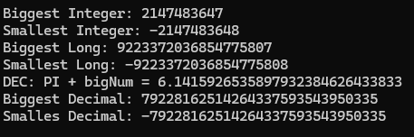
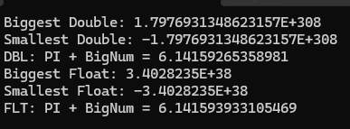

# Receive User Input

Previously, we use `Console.Writeln`. What `Console.Writeln()` does? It's insert new line after it.

If you want to receive user input, here's the example of it:

```csharp
static void Main(string[] args)
{
    Console.Write("What is your name? ");
    string name = Console.ReadLine();

    Console.WriteLine($"Hello {name}");
}
```

The result : <br>
 


# Variables
variable is use to store different types of data.

```csharp
static void Main(string[] args)
{
    bool canIvote = true;

    Console.WriteLine("Biggest Integer: {0}", int.MaxValue);
    Console.WriteLine("Smallest Integer: {0}", int.MinValue);

    Console.WriteLine("Biggest Long: {0} ", long.MaxValue);
    Console.WriteLine("Smallest Long: {0} ", long.MinValue);

    decimal decPiVal = 3.1415926535897932384626433832M; // store 128 bytes
    decimal decBigNum = 3.00000000000000000000000000011M;
    Console.WriteLine("DEC: PI + bigNum = {0}", decPiVal + decBigNum);

    Console.WriteLine("Biggest Decimal: {0}", Decimal.MaxValue);
    Console.WriteLine("Smalles Decimal: {0}", Decimal.MinValue);
}
```

The result: <br>
 


Another part of data types:
```csharp
static void Main(string[] args)
{
    Console.WriteLine("Biggest Double: {0}", Double.MaxValue);
    Console.WriteLine("Smallest Double: {0}", Double.MinValue);
    double dblPiVal = 3.14159265358979;
    double dblBigNum = 3.00000000000002;
    Console.WriteLine("DBL: PI + BigNum = {0}",
        dblPiVal + dblBigNum);

    Console.WriteLine("Biggest Float: {0}", float.MaxValue);
    Console.WriteLine("Smallest Float: {0}", float.MinValue);
    double fltPiVal = 3.141592F;
    double fltBigNum = 3.000002F;
    Console.WriteLine("FLT: PI + BigNum = {0}",
        fltPiVal + fltBigNum);
}
```

The result: <br>
 


<br>

[The Documentation Link about Data Types](https://learn.microsoft.com/en-us/dotnet/csharp/language-reference/builtin-types/floating-point-numeric-types)


Other Data Types:
* `byte`: 8-bit unsigned int 0 to 255
* `char`: 16-bit unicode character
* `sbyte`: 8-bit signed int 128 to 127
* `short`: 16-bit signed int -32,768 to 32,767
* `uint`: 32-bit unsigned int 0 to 4,294,967,295
* `ulong`: 64-bit unsigned int 0 to 18,446,744,073,709,551,615
* `ushort`: 16-bit unsigned int 0 to 65,535

### Bagaimana implementasi 'Other Data Types' tersebut?
1. `byte` digunakan untuk menyimpan data numerik yang tidak perlu bernilai negatif, misalnya untuk menyimpan nilai RGB dalam representasi warna.
```csharp
byte red = 255;
byte green = 128;
byte blue = 0;
```

2. `char` Digunakan untuk menyimpan karakter Unicode tunggal, misalnya untuk menyimpan karakter dari input pengguna.
```csharp
char gender = 'M';
```

3. `sbyte`: Digunakan untuk menyimpan data numerik yang membutuhkan nilai negatif atau positif yang kecil. Contoh:
```csharp
sbyte temperature = -10;
```

4. `short`: Digunakan untuk menyimpan data numerik yang membutuhkan rentang nilai yang lebih besar dari `sbyte`. Contoh: 
```csharp
short population = 30000;
```

5. `uint`: Digunakan untuk menyimpan data numerik yang hanya bernilai positif. 
Contoh:
```csharp
uint score = 1000;
```

6. `ulong`: Digunakan untuk menyimpan data numerik yang membutuhkan rentang nilai yang sangat besar. Contoh: 
```csharp
ulong bigNumber = 18446744073709551615;
```

7. `ushort`: Digunakan untuk menyimpan data numerik yang tidak perlu bernilai negatif dan membutuhkan rentang nilai yang lebih besar dari `byte`. Contoh: 
```csharp
ushort smallNumber = 65535;
```


> Pemilihan tipe data yang tepat sangat penting untuk mengoptimalkan penggunaan memori dan memastikan nilai yang disimpan sesuai dengan kebutuhan aplikasi.