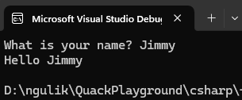

# Receive User Input

Previously, we use `Console.Writeln`. What `Console.Writeln()` does? It's insert new line after it.

If you want to receive user input, here's the example of it:

```csharp
static void Main(string[] args)
{
    Console.Write("What is your name? ");
    string name = Console.ReadLine();

    Console.WriteLine($"Hello {name}");
}
```

The result : <br>
 


