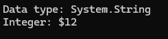
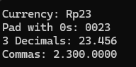

# Casting

The ability to convert data types into another data types

```csharp
static void Main(string[] args)
{
    bool boolFromStr = bool.Parse("true");
    int intFromStr = int.Parse("100");
    double dblFromStr = double.Parse("1.234");

    string strVal = dblFromStr.ToString();
    Console.WriteLine($"Data type: {strVal.GetType()}");

    // explicit conversion
    double dblNum = 12.345;
    Console.WriteLine($"Integer: ${(int)dblNum}");

    // implicit conversion (smaller size to bigger size data types)
    int intNum = 10;
    long longNum = intNum;


}
```

The result: <br>



# Formatting Output

```csharp
static void Main(string[] args)
{
    Console.WriteLine("Currency: {0:c}", 23.455); // $23.45
    Console.WriteLine("Pad with 0s: {0:d4}", 23); // d4 = 4 spaces -> 0023
    Console.WriteLine("3 Decimals: {0:f3}", 23.45555); // 23.456
    Console.WriteLine("Commas: {0:n4}", 2300); // 2,300.0000
}
```

The result: <br>
 


[<- back](https://github.com/QuackPlayground/csharp/blob/main/theory/basic/02.md)
[continue ->](https://github.com/QuackPlayground/csharp/blob/main/theory/basic/04.md)