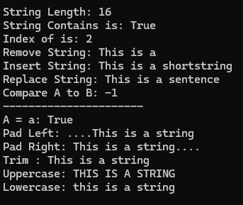

# String Functions

String just store a series of character

```csharp
static void Main(string[] args)
{
    string randString = "This is a string";
    Console.WriteLine("String Length: {0}", randString.Length);
    Console.WriteLine("String Contains is: {0}", randString.Contains("is"));
    Console.WriteLine("Index of is: {0}", randString.IndexOf("is"));
    Console.WriteLine("Remove String: {0}", randString.Remove(10, 6));
    Console.WriteLine("Insert String: {0}", randString.Insert(10, "short")); // insert in index 10 -> word "short"
    Console.WriteLine("Replace String: {0}", randString.Replace("string", "sentence")); // replace "string" with "sentence"
    Console.WriteLine("Compare A to B: {0}", String.Compare("A", "B", StringComparison.OrdinalIgnoreCase)); // dengan mengabaikan perbedaan huruf besar-kecil (case-insensitive).

    Console.WriteLine("----------------------");

    Console.WriteLine("A = a: {0}", String.Equals("A", "a", StringComparison.OrdinalIgnoreCase));
    Console.WriteLine("Pad Left: {0}", randString.PadLeft(20, '.'));
    Console.WriteLine("Pad Right: {0}", randString.PadRight(20, '.'));
    Console.WriteLine("Trim : {0}", randString.Trim());
    Console.WriteLine("Uppercase: {0}", randString.ToUpper());
    Console.WriteLine("Lowercase: {0}", randString.ToLower());
}
```

Compare strings and ignore case
* `< 0` : str 1 preceeds str2
* `=` : zero
* `> 0`: str2 preceeds str1

> angka 20 yang menjadi parameter kedua dalam metode `PadLeft` menentukan panjang total string setelah dilakukan padding. Metode `PadLeft` akan menambahkan karakter (dalam contoh tersebut, titik '.') di sebelah kiri string `randString` sampai string tersebut mencapai panjang 20 karakter. Jika panjang string `randString` sudah lebih dari atau sama dengan 20 karakter, metode ini tidak akan melakukan apa pun.

Result: <br>
 

# Format

```csharp
string newString = String.Format("{0} saw a {1} {2} in the {3}", "Paul", "rabbit", "eating", "field");
Console.Write(newString + "\n");
```

The result: `Paul saw a rabbit eating in the field`


# Escape Characters

Example of escape characters:
* `\'`
* `\"`
* `\\`
* `\t`
* `\a`

# Verbatim Strings
untuk mencetak sama persis dengan apa yang dituliskan, termasuk backslash nya.

Contoh:
```csharp
Console.WriteLine(@"Exactly what I type\n");
```

Hasil: `Exactly what I type\n`


[<- back](https://github.com/QuackPlayground/csharp/blob/main/theory/basic/03.md)
[continue ->](https://github.com/QuackPlayground/csharp/blob/main/theory/basic/05.md)