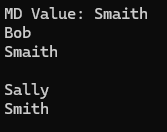

# Arrays

* Arrays contains multiple different value but in the same data types with index start from 0.
* Arrays have a fix size

```csharp
static void Main(string[] args)
{
    int[] favNums = new int[3];
    favNums[0] = 23;
    Console.WriteLine("favNum at index 0: {0}", favNums[0]);

    string[] customers = { "Bob", "Sally", "Sue" };
    var employees = new[] { "Mike", "Paul", "Rick" };

    // array for different types with object
    object[] randomArray = { "Paul", 45, 1.234 };

    Console.WriteLine("randomArray 0: {0}", randomArray[0].GetType());
    Console.WriteLine("Array Size: {0}", randomArray.Length);
}
```

Result: <br>


# For Loops

```csharp
static void Main(string[] args) {
    object[] randomArray = { "Paul", 45, 1.234 };

    Console.WriteLine("randomArray 0: {0}", randomArray[0].GetType());
    Console.WriteLine("Array Size: {0}", randomArray.Length);

    for (int j = 0; j < randomArray.Length; j++)
    {
        Console.WriteLine("Array: {0}, Value: {1}", j, randomArray[j]);
    }

    Console.WriteLine('------------------');
}
```

Result: <br>
 


# Multidimensional Array

```csharp
static void Main(string[] args) {
    // multidimensional array
    string[,] custNames = new string[2, 2] { { "Bob", "Smaith" }, { "Sally", "Smith" } };

    Console.WriteLine("MD Value: {0}", custNames.GetValue(0, 1));

    for (int j = 0; j < custNames.GetLength(0); j++)
    {
        for (int k = 0; k < custNames.GetLength(0); k++)
        {
            Console.WriteLine("{0} ", custNames[j, k]);
        }
        Console.WriteLine();
    }
}
```

Result: <br>



[<- back](https://github.com/QuackPlayground/csharp/blob/main/theory/basic/04.md)
[continue ->](https://github.com/QuackPlayground/csharp/blob/main/theory/basic/06.md)