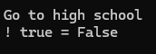
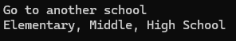

# If / Else / Else If

```csharp
static void Main(string[] args)
{
    // Relational Operators: > < >= <= == !=
    // Logical Operators: && || !

    int age = 17;
    if ((age >= 5) && (age <= 7))
    {
        Console.WriteLine("Go to elementary school");
    }

    if ((age >= 7) && (age < 13))
    {
        Console.WriteLine("Go to middle school");
    }

    if ((age >= 13) && (age < 19))
    {
        Console.WriteLine("Go to high school");
    } else
    {
        Console.WriteLine("Go to College");
    }

    
    if ((age < 14) || (age > 67))
    {
        Console.WriteLine("You shouldn't work");
    }

    Console.WriteLine("! true = " + (!true));

}
```

Result: <br>
 <br>

-----

there's a thing that called ternary operator. Example: <br>
```csharp
bool canDrive = age >= 16 ? true : false;
```


# Switch

Swith is use when you have limited number of options.

```csharp
    switch (age)
    {
        case 1:
        case 2:
            Console.WriteLine("Go to Day Care");
            break;
        case 3:
        case 4:
            Console.WriteLine("Go to Preschool");
            break;
        case 5:
            Console.WriteLine("Go to Kindergarten");
            break;
        default:
            Console.WriteLine("Go to another school");
            goto OtherSchool;
    }

OtherSchool:
    Console.WriteLine("Elementary, Middle, High School");
```

Penggunaan `goto` tidak dianjurkan karena membuat kode sulit dipahami.

Result: <br>
 


-----
Hal lain yang bisa dilakukan adalah compare string dengan `equals`

```csharp
string name2 = "Derek";
string name3 = "Derek";

if (name2.Equals(name3, StringComparison.Ordinal))
{
    Console.WriteLine("Names are equal");
}
```

perbandingan dengan `equals` basically sama dengan perbandingan menggunakan operator `==`, bedanya.. penggunaan menggunakan `equals` dan `StringComparison.Ordinal` lebih aman karena mengecek unicode juga..

```csharp
string name2 = "Derek";
string name3 = "Derek";

if (name2 == name3)
{
    Console.WriteLine("Names are equal");
}

```

Result: <br>
 


[<- back](https://github.com/QuackPlayground/csharp/blob/main/theory/basic/05.md)
[continue ->](https://github.com/QuackPlayground/csharp/blob/main/theory/basic/07.md)