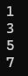
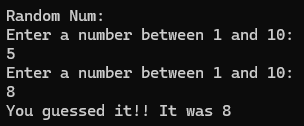

# While

```csharp
static void Main(string[] args)
{
    int i = 1;

    while (i <= 10)
    {
        if (i % 2 == 0)
        {
            i++;
            continue;
        }

        if (i == 9) break;
        Console.WriteLine(i);
        i++;
    }
}
```

Result: <br>
 


# Do While
If you want to execute the code at least one time.

```csharp
static void Main(string[] args)
{
    Random rnd = new Random();
    int secretNumber = rnd.Next(1, 11);
    int numberGuessed = 0;

    Console.WriteLine("Random Num: ", secretNumber);

    do
    {
        Console.WriteLine("Enter a number between 1 and 10: ");
        numberGuessed = Convert.ToInt32(Console.ReadLine());

    } while (secretNumber != numberGuessed);

    Console.WriteLine("You guessed it!! It was {0}", secretNumber);
}
```

Result: <br>
 


[<- back](https://github.com/QuackPlayground/csharp/blob/main/theory/basic/06.md)
[continue ->](https://github.com/QuackPlayground/csharp/blob/main/theory/basic/08.md)