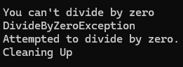

# Exception Handling

We use exception handling to catch error

```csharp
using System; // import namespace system

namespace ConsoleApp1
{
    public class Program
    {

        // -- FUNCTIONS --

        static double DoDivision(double x, double y)
        {
            if (y == 0)
            {
                throw new System.DivideByZeroException();
            }
            return x / y;
        }

        // -- END OF FUNCTIONS

        static void Main(string[] args)
        {
            double num1 = 5;
            double num2 = 0; 

            try
            {
                Console.WriteLine("5 / 0 = {0}", DoDivision(num1, num2));
            } catch (DivideByZeroException ex)
            {
                Console.WriteLine("You can't divide by zero");
                Console.WriteLine(ex.GetType().Name);
                Console.WriteLine(ex.Message);
            } catch (Exception ex)
            {
                // default exception
                Console.WriteLine("An error occurred");
                Console.WriteLine(ex.GetType().Name);
                Console.WriteLine(ex.Message);
            }

            finally
            {
                Console.WriteLine("Cleaning Up");
            }

        }
    }
}
```

Result: <br>
 


[Dokumentasi Type](https://learn.microsoft.com/en-us/dotnet/api/system.type?view=net-8.0)


[<- back](https://github.com/QuackPlayground/csharp/blob/main/theory/basic/07.md)
[continue ->](https://github.com/QuackPlayground/csharp/blob/main/theory/basic/09.md)