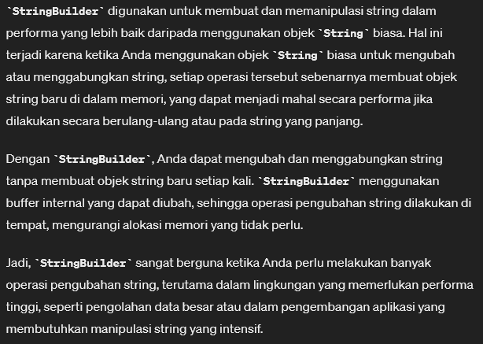
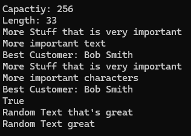

# StringBuilder

Ketika kita mengubah string, hal yang sebenarnya dilakukan adalah membuat baru Object String, yang mana itu tidak efektif terutama jika bekerja dengan banyak block.

Nah, disitulah kita perlu `StringBuilder` yang akan melakukan perubahan pada string langsung pada memori.

Penjelasan lengkapnya: <br>
 <br>


```csharp
using System;
using System.Globalization;
using System.Text; // import namespace system

namespace ConsoleApp1
{
    public class Program
    {

        // -- FUNCTIONS --

        

        // -- END OF FUNCTIONS

        static void Main(string[] args)
        {
            StringBuilder sb = new StringBuilder("Random Text");
            StringBuilder sb2 = new StringBuilder("More Stuff that is very important", 256);

            Console.WriteLine("Capactiy: {0}", sb2.Capacity);
            Console.WriteLine("Length: {0}", sb2.Length);

            sb2.AppendLine("\nMore important text");
            CultureInfo enUS = CultureInfo.CreateSpecificCulture("en-US");

            string bestCust = "Bob Smith";
            // untuk menambahkan string dengan format tertentu ke sb2, di mana {0} akan digantikan dengan nilai dari bestCust.
            sb2.AppendFormat(enUS, "Best Customer: {0}", bestCust);

            Console.WriteLine(sb2.ToString());
            sb2.Replace("text", "characters");
            Console.WriteLine(sb2.ToString());
            sb2.Clear();
            sb2.Append("Random Text");
            Console.WriteLine(sb.Equals(sb2));

            sb2.Insert(11, " that's great");
            Console.WriteLine(sb2.ToString());

            // remove 
            sb2.Remove(11, 7);
            Console.WriteLine(sb2.ToString());
        }
    }
}
```

Result: <br>
 <br>


----
Contoh penggunaan: `CultureInfo enUS = CultureInfo.CreateSpecificCulture("en-US");`
<br>

```csharp
using System;
using System.Globalization;

class Program
{
    static void Main()
    {
        CultureInfo enUS = CultureInfo.CreateSpecificCulture("en-US");

        // Contoh format angka dengan CultureInfo
        double number = 12345.6789;
        Console.WriteLine(number.ToString("C", enUS)); // Menampilkan sebagai mata uang

        // Contoh format tanggal dengan CultureInfo
        DateTime now = DateTime.Now;
        Console.WriteLine(now.ToString("D", enUS)); // Menampilkan sebagai tanggal lengkap

        // Contoh format waktu dengan CultureInfo
        Console.WriteLine(now.ToString("T", enUS)); // Menampilkan sebagai waktu dalam format 24 jam

        // Contoh parsing string dengan CultureInfo
        string numberString = "123,45";
        double parsedNumber = double.Parse(numberString, enUS);
        Console.WriteLine(parsedNumber); // Menampilkan hasil parsing string sebagai angka

        // Contoh menggunakan CultureInfo untuk format dalam string interpolation
        string name = "John";
        int age = 30;
        Console.WriteLine($"Hello, my name is {name} and I am {age} years old.", enUS);
    }
}

```

Hasilnya: <br>
```terminal
$12,345.68
Wednesday, April 10, 2024
1:30:00 PM
123.45
Hello, my name is John and I am 30 years old.

```


[<- back](https://github.com/QuackPlayground/csharp/blob/main/theory/basic/08.md)
[continue ->](https://github.com/QuackPlayground/csharp/blob/main/theory/basic/10.md)