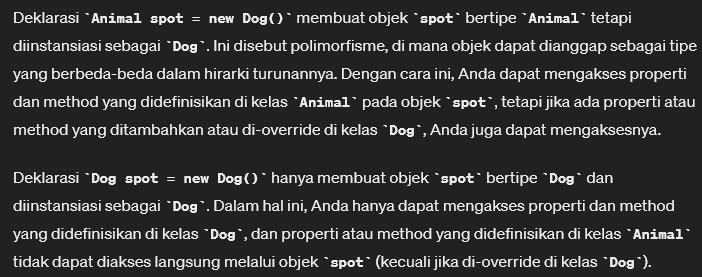

# Inheritance
Pewarisan class (sama seperti pada bahasa pemrograman lainnya).

Agar dapat diakses oleh class turunan, maka access modifier yang digunakan pada properties di class parent adalah `protected`

* kata kunci `virtual` digunakan untuk mendeklarasikan bahwa sebuah method, property, atau indexer dapat di-override oleh kelas turunannya.

> AnimalIDInfo.cs
```csharp
using System;
using System.Collections.Generic;
using System.Linq;
using System.Text;
using System.Threading.Tasks;

namespace firstcsharp
{
    class AnimalIDInfo
    {
        public int IDNumber { get; set; } = 0;
        public string Owner { get; set; } = "No Owner";
    }
}

```


# Inner Class

Common way to create class inside of class and whenever you use this, this is concern to be helper class for our class. 

> Animal.cs

```csharp
using System;
using System.Collections.Generic;
using System.Linq;
using System.Text;
using System.Threading.Tasks;

namespace firstcsharp
{
    class Animal
    {
        private string name;
        protected string sound;

        protected AnimalIDInfo animalIdInfo = new AnimalIDInfo();

        public void SetAnimalIDInfo(int idNum, string owner)
        {
            animalIdInfo.IDNumber = idNum;
            animalIdInfo.Owner = owner;
        }

        public void GetAnimalIDInfo()
        {
            Console.WriteLine($"{Name} has the ID of {animalIdInfo.IDNumber} and is owned by {animalIdInfo.Owner}");
        }

        public virtual void MakeSound()
        {
            Console.WriteLine($"{Name} says {Sound}");
        }

        // constructor chaining
        public Animal() : this("No Name", "No Sound") { } // default animal if nothing set

        public Animal(string name) : this (name, "No Sound") { }

        public Animal(string name, string sound)
        {
            Name = name;
            Sound = sound;
        }

        public string Name
        {
            get { return name; }
            set
            {
                if (value.Any(char.IsDigit))
                {
                    name = "No Name";
                    Console.WriteLine("Can't use numbers in name");
                }
                name = value;
            }
        }

        public string Sound
        {
            get { return sound; }
            set
            {
                if (value.Length > 10)
                {
                    sound = "No Sound";
                    Console.WriteLine("Sound is too long");
                } else
                {
                    sound = value;
                }
            }
        }

        public class AnimalHealth
        {
            public bool HealthyWeight(double height, double weight)
            {
                double calc = height / weight;
                if ((calc >= .18) && (calc <= .27))
                {
                    return true;
                }
                else return false;
            }
        }
    }
}


```

# Implementasi Inheritance 

> Dog.cs

```csharp
namespace firstcsharp
{
    class Dog : Animal
    {
        public string Sound2 { get; set; } = "Grrrrr";

        public override void MakeSound()
        {
            Console.WriteLine($"{Name} says {Sound} and {Sound2}");
        }

        // override method
        public Dog(string name = "No Name", string sound = "No Sound", string sound2 = "No Sound 2") : base(name, sound) // name and sound is handled by parent
        {
            Sound2 = sound2;
        }
    }
}

```


# Implementasi pada Program

> Program.cs

```csharp

using firstcsharp;
using Microsoft.CodeAnalysis;
using System;
using System.ComponentModel.Design;
using System.Globalization;
using System.Text; // import namespace system

namespace ConsoleApp1
{
    public class Program
    {

        // -- FUNCTIONS --


        // -- END OF FUNCTIONS


        static void Main(string[] args)
        {
            Animal whiskers = new Animal()
            {
                Name = "Whiskers",
                Sound = "Meow"
            };

            Dog grover = new Dog()
            {
                Name = "Grover",
                Sound = "Woof",
                Sound2 = "Grrrr"
            };

            grover.Sound = "Wooooof";

            whiskers.MakeSound();
            grover.MakeSound();

            whiskers.SetAnimalIDInfo(12345, "Sally Smith");
            grover.SetAnimalIDInfo(12346, "Paul Brown");

            whiskers.GetAnimalIDInfo();

            // inner class test
            Animal.AnimalHealth getHealth = new Animal.AnimalHealth();

            Console.WriteLine("Is my animal healthy: {0}",
                getHealth.HealthyWeight(11, 46));

            Animal monkey = new Animal()
            {
                Name = "Happy",
                Sound = "Eeeeee"
            };

            Animal spot = new Dog()
            {
                Name = "Spot",
                Sound = "Wooooffff",
                Sound2 = "Geeeerrrr"
            };

            spot.MakeSound();
                  
        }

    }
}

```


Hasil: <br>
```terminal
Whiskers says Meow
Grover says Wooooof and Grrrr
Whiskers has the ID of 12345 and is owned by Sally Smith
Is my animal healthy: True
Spot says Wooooffff and Geeeerrrr
```


## Apa bedanya deklarasi: `Animal spot = new Dog()` dengan `Dog spot = new Dog()` ?




[<- back](https://github.com/QuackPlayground/csharp/blob/main/theory/basic/18.md)
[continue ->](https://github.com/QuackPlayground/csharp/blob/main/theory/basic/20.md)