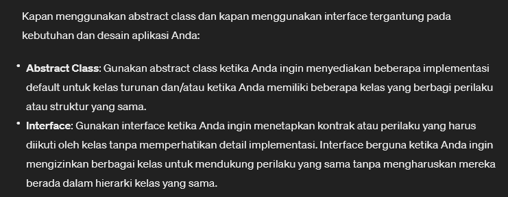

# Interfaces

* interface is a contract. If you implement interface, you should derrivate the method in interface

> IDrivable.cs

```csharp
namespace chapter3
{
    interface IDrivable
    {
        int Wheels { get; set; }
        double Speed { get; set; }

        void Move();
        void Stop();
    }
}

```

<br>

> Vehicle.cs

```csharp
namespace chapter3
{
    class Vehicle : IDrivable
    {
        public string Brand { get; set; }

        public Vehicle(string brand = "No Brand", int wheels = 0, double speed = 0) {
            Brand = brand;
            Wheels = wheels;
            Speed = speed;
        }

        public double Speed { get; set; }
        public int Wheels { get; set; } 

        public void Move()
        {
            Console.WriteLine($"The {Brand} Moves Forward at {Speed} MPH");
        }

        public void Stop()
        {
            Console.WriteLine($"The {Brand} Stops");
            Speed = 0;
        }
    }
}

```

<br>

> Program.cs

```csharp
using chapter3;
using System;

namespace Chapter3
{
    public class Program
    {
        static void Main(string[] args)
        {
            Vehicle buick = new Vehicle("Buick", 4, 160);

            // is vehicle implements IDrivable?
            if (buick is IDrivable)
            {
                buick.Move();
                buick.Stop();
            } else
            {
                Console.WriteLine("The {0} can't be driven", buick.Brand);
            }
        }
    }
}

```


Result: <br>
```terminal
The Buick Moves Forward at 160 MPH
The Buick Stops
```


------

## INFO

Perbedaan utama antara interface dan abstract class:

1. Abstract Class
    * abstract class dapat memiliki implementasi (kode) untuk beberapa atau semua methodnya, sementara juga dapat memiliki method yang bersifat abstrak (tidak memiliki implementasi dan harus di override oleh kelas turunannya).
    * Abtract class dapat memiliki field dan properti dengan implementasi atau tanpa implementasi
    * Sebuah kelas dapat mewarisi hanya satu abstract class, karena C# tidak mendukung multiple inheritance untuk kelas
2. Interface
    * Interface tidak memiliki implementasi untuk method, hanya deklarasi method (tidak ada body method)
    * Interface tidak dapat memiliki field (variabel kelas) atau properti dengan implementasi
    * Sebuah kelas dapat menerapkan banyak interface, memungkinkan untuk multiple inheritance dari sudut pandang implementasi

**When to use interface or abstract?** <br>

 <br>


### Contoh Nyata Implementasi Abtract Class
Misalkan Anda membuat sistem untuk mengelola berbagai jenis bentuk geometri seperti persegi, lingkaran, dan segitiga. Anda dapat membuat abstract class `Shape` yang memiliki method `CalculateArea` dan `CalculatePerimeter` sebagai method abstrak, dan kemudian memiliki implementasi default untuk properti atau method lain yang mungkin berlaku untuk semua bentuk geometri. Kelas-kelas konkret seperti `Square`, `Circle`, dan `Triangle` dapat mewarisi `Shape` dan mengimplementasikan method abstrak sesuai dengan bentuknya masing-masing.

### Contoh Nyata Implementasi Interface
Misalkan Anda membuat aplikasi untuk mengelola data pengguna dari berbagai sumber seperti database, file CSV, dan API web. Anda dapat membuat `interface IDataSource` yang mendefinisikan method `GetData` dan `SaveData`. Kelas-kelas yang mewakili sumber data seperti `DatabaseSource`, `CsvFileSource`, dan `ApiDataSource` dapat mengimplementasikan `interface IDataSource` untuk menyediakan cara yang konsisten untuk mendapatkan dan menyimpan data, meskipun sumber datanya berbeda-beda.

> Dalam kedua contoh tersebut, penggunaan abstract class dan interface membantu dalam membangun struktur yang fleksibel dan mudah di-maintain, serta memungkinkan untuk penggunaan polimorfisme untuk memperlakukan objek secara generik tanpa peduli tentang detail implementasi mereka.


[<- back](https://github.com/QuackPlayground/csharp/blob/main/theory/basic/20.md)
[continue ->](https://github.com/QuackPlayground/csharp/blob/main/theory/basic/22.md)