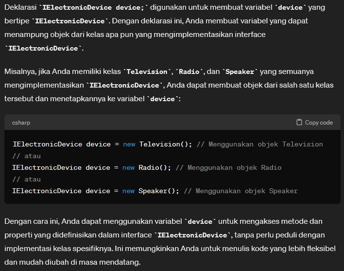

# Complex OOP Example

> IElectronicDevice.cs

```csharp
namespace OOPExample
{
    interface IElectronicDevice
    {
        void On();
        void Off();
        void VolumeUp();
        void VolumeDown();
    }
}

```

-----

> Television.cs

```csharp
namespace OOPExample
{
    class Television : IElectronicDevice
    {
        public int Volume { get; set; }

        public void Off() 
        {
            Console.WriteLine("The TV is Off");
        }   

        public void On() 
        {
            Console.WriteLine("The TV is On");
        }

        public void VolumeUp() 
        {
            if (Volume != 100) Volume++;
            Console.WriteLine($"The TV Volume is at {Volume}");
        }

        public void VolumeDown() 
        {
            if (Volume != 0) Volume--;
            Console.WriteLine($"The TV Volume is at {Volume}");
        }
    }
}
```

------

> TVRemote.cs

```csharp
namespace OOPExample
{
    class TVRemote
    {
        
        public static IElectronicDevice GetDevice()
        {
            return new Television();
        }
    }
}
```

-------

> ICommand.cs

```csharp
namespace OOPExample
{
    interface ICommand
    {
        void Execute();
        void Undo();
    }
}
```
-------

> PowerButton.cs

```csharp
namespace OOPExample
{
    class PowerButton : ICommand
    {
        // refer to instances
        IElectronicDevice device;

        public PowerButton(IElectronicDevice device)
        {
            this.device = device;
        }

        public void Execute() 
        {
            device.On();
        }

        public void Undo() 
        { 
            device.Off();
        }
    }
}
```

Sedikit informasi mengenai `IElectronicDevice device;` : <br>
 


------

> Program.cs

```csharp
using OOPExample;
using System;


namespace ComplexOOP
{
    public class Program
    {
        static void Main(string[] args)
        {
            IElectronicDevice TV = TVRemote.GetDevice();

            PowerButton powButt = new PowerButton(TV); // we know that we work for TV device

            powButt.Execute();
            powButt.Undo();

            powButt.Execute();
            powButt.Undo();
        }
    }
}

```

Hasil: <br>
```terminal
The TV is On
The TV is Off
The TV is On
The TV is Off
```

-----

[Artikel tentang Factory Pattern](https://www.bytehide.com/blog/abstact-factory-pattern-csharp)


[<- back](https://github.com/QuackPlayground/csharp/blob/main/theory/basic/21.md)
[continue ->](https://github.com/QuackPlayground/csharp/blob/main/theory/basic/22-part2.md)