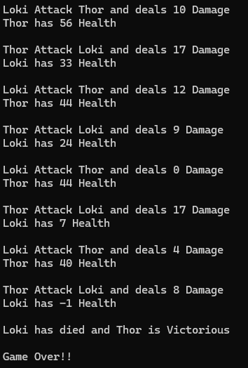

# Warriors Fight to the Death

* Thor attacks Hulk and deals 74 Damage
* Maximus has 69 Health (hulk will lose 69 amount of health)

* Hulk attacks Thor and deals 6 Damage
* Bob has 6 Health

* Thor attacks Hulk and deals 48 Damage
* Bob has -42 health

* Thor has Died and Hulk is Victorious

* Game Over

> The purpose of OOP is to keep our code extremely simple and understandable

------------

> Warrior.cs

```csharp
namespace funproj
{
    class Warrior
    {
        public string Name { get; set; }   
        public double Health { get; set; }
        public double AttkMax { get; set; } 
        public double BlockMax { get; set; }

        Random rnd = new Random();
        
        public Warrior(string name = "Warrior", 
            double health = 0,
            double attckMax = 0,
            double blockMax = 0)
        {
            Name = name;
            Health = health;
            AttkMax = attckMax;
            BlockMax = blockMax;
        }

        public double Attack()
        {
            return rnd.Next(1, (int)AttkMax);
        }

        public virtual double Block()
        {
            return rnd.Next(1, (int)BlockMax);
        }
    }
}

```

---------

> Battle.cs

```csharp
namespace funproj
{
    class Battle
    {
        // StartFight
        // warrior1 attacks warrior2, warrior2 is damaged and health decreased
        // Get attack result
        // warrior2 attacks warrior1, warrior1 is damaged and health decreased
        // Get attack result

        public static void StartFight(Warrior warrior1, Warrior warrior2)
        {
            while(true)
            {
                if (GetAttackResult(warrior1, warrior2) == "Game Over")
                {
                    Console.WriteLine("Game Over!!");
                    break;
                }

                if (GetAttackResult(warrior2, warrior1) == "Game Over")
                {
                    Console.WriteLine("Game Over!!");
                    break;
                }

            }
        }


        // Get Attack Result
        public static string GetAttackResult(Warrior warriorA, Warrior warriorB)
        {
            double warAAttackAmount = warriorA.Attack();
            double warBBlockAmount = warriorB.Block();

            double dmgToWarB = warAAttackAmount - warBBlockAmount;

            if (dmgToWarB > 0)
            {
                warriorB.Health = warriorB.Health - dmgToWarB;
            } else
            {
                dmgToWarB = 0;
            }

            Console.WriteLine("{0} Attack {1} and deals {2} Damage", warriorA.Name, warriorB.Name, dmgToWarB);
            Console.WriteLine("{0} has {1} Health\n", warriorB.Name, warriorB.Health);

            if(warriorB.Health <= 0)
            {
                Console.WriteLine("{0} has died and {1} is Victorious\n", warriorB.Name, warriorA.Name);

                return "Game Over";
            } else
            {
                return "Fight Again";
            }
        }

    }
}

```

-------------
> Program.cs

```csharp
using funproj;
using System;


namespace FunProj
{
    public class Program
    {
        static void Main(string[] args)
        {
            Warrior thor = new Warrior("Thor", 100, 26, 10); // health, damage, how much he can block
            Warrior loki = new Warrior("Loki", 100, 26, 10);
            
            Battle.StartFight(thor, loki);
        }
    }
}
```
Result: <br>
 <br>

---------

<h3>Let's make the game more fun!!</h3>

> Teleport.cs

```csharp
namespace funproj
{
    interface Teleports
    {
        string teleport();
    }
}
```

---------

> CanTeleport.cs

```csharp
namespace funproj
{
    class CanTeleport : Teleports
    {
        public string teleport()
        {
            return "Teleports Away";
        }
    }
}
```

> CantTeleport.cs

```csharp
namespace funproj
{
    class CantTeleport : Teleports
    {
        public string teleport()
        {
            return "Fails at Teleporting";
        }
    }
}
```

--------------

> MagicWarrior.cs

```csharp
namespace funproj
{
    class MagicWarrior : Warrior
    {
        int teleportChance = 0;
        CanTeleport teleportType = new CanTeleport();

        public MagicWarrior(string name = "Warrior",
            double health = 0,
            double attkMax = 0,
            double blockMax = 0,
            int teleportChance = 0) : base (name, health, attkMax, blockMax) 
        {
            this.teleportChance = teleportChance;
        }

        public override double Block()
        {
            Random rnd = new Random();
            int rndDodge = rnd.Next(1, 100);

            if (rndDodge < this.teleportChance)
            {
                Console.WriteLine($"{Name} {teleportType.teleport()}");
                return 10000;
            } else
            {
                return base.Block();
            }
        }

    }
}

```

----------

> Program.cs

```csharp
using funproj;
using System;


namespace FunProj
{
    public class Program
    {
        static void Main(string[] args)
        {
            Warrior thor = new Warrior("Thor", 100, 26, 10); // health, damage, how much he can block
            MagicWarrior loki = new MagicWarrior("Loki", 75, 20, 10, 50); 
            
            Battle.StartFight(thor, loki);
        }
    }
}
```

Result: <br>
```terminal
Loki Teleports Away
Thor Attack Loki and deals 0 Damage
Loki has 75 Health

Loki Attack Thor and deals 13 Damage
Thor has 87 Health

Thor Attack Loki and deals 10 Damage
Loki has 65 Health

Loki Attack Thor and deals 11 Damage
Thor has 76 Health

Loki Teleports Away
Thor Attack Loki and deals 0 Damage
Loki has 65 Health

Loki Attack Thor and deals 2 Damage
Thor has 74 Health

Thor Attack Loki and deals 13 Damage
Loki has 52 Health

Loki Attack Thor and deals 0 Damage
Thor has 74 Health

Thor Attack Loki and deals 2 Damage
Loki has 50 Health

Loki Attack Thor and deals 0 Damage
Thor has 74 Health

Thor Attack Loki and deals 7 Damage
Loki has 43 Health

Loki Attack Thor and deals 2 Damage
Thor has 72 Health

Thor Attack Loki and deals 17 Damage
Loki has 26 Health

Loki Attack Thor and deals 2 Damage
Thor has 70 Health

Loki Teleports Away
Thor Attack Loki and deals 0 Damage
Loki has 26 Health

Loki Attack Thor and deals 13 Damage
Thor has 57 Health

Thor Attack Loki and deals 6 Damage
Loki has 20 Health

Loki Attack Thor and deals 0 Damage
Thor has 57 Health

Loki Teleports Away
Thor Attack Loki and deals 0 Damage
Loki has 20 Health

Loki Attack Thor and deals 2 Damage
Thor has 55 Health

Thor Attack Loki and deals 6 Damage
Loki has 14 Health

Loki Attack Thor and deals 0 Damage
Thor has 55 Health

Loki Teleports Away
Thor Attack Loki and deals 0 Damage
Loki has 14 Health

Loki Attack Thor and deals 0 Damage
Thor has 55 Health

Loki Teleports Away
Thor Attack Loki and deals 0 Damage
Loki has 14 Health

Loki Attack Thor and deals 0 Damage
Thor has 55 Health

Loki Teleports Away
Thor Attack Loki and deals 0 Damage
Loki has 14 Health

Loki Attack Thor and deals 11 Damage
Thor has 44 Health

Loki Teleports Away
Thor Attack Loki and deals 0 Damage
Loki has 14 Health

Loki Attack Thor and deals 13 Damage
Thor has 31 Health

Thor Attack Loki and deals 12 Damage
Loki has 2 Health

Loki Attack Thor and deals 4 Damage
Thor has 27 Health

Loki Teleports Away
Thor Attack Loki and deals 0 Damage
Loki has 2 Health

Loki Attack Thor and deals 1 Damage
Thor has 26 Health

Loki Teleports Away
Thor Attack Loki and deals 0 Damage
Loki has 2 Health

Loki Attack Thor and deals 0 Damage
Thor has 26 Health

Loki Teleports Away
Thor Attack Loki and deals 0 Damage
Loki has 2 Health

Loki Attack Thor and deals 0 Damage
Thor has 26 Health

Thor Attack Loki and deals 15 Damage
Loki has -13 Health

Loki has died and Thor is Victorious

Game Over!!
```


[<- back](https://github.com/QuackPlayground/csharp/blob/main/theory/basic/22-part2.md)
[continue ->](https://github.com/QuackPlayground/csharp/blob/main/theory/basic/24.md)