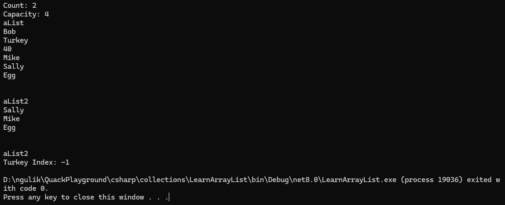

# Array List

`#region` dan `#endregion` adalah direktif preprosesor dalam C# yang digunakan untuk mengelompokkan bagian-bagian dari kode ke dalam "region" yang dapat dilipatkan/diluruskan dalam editor kode. Mereka digunakan untuk membantu dalam mengorganisir kode menjadi bagian-bagian yang lebih terdefinisi.

```csharp
#region Array List Code

#endregion
```

Salah satu keunggulan dari ArrayList adalah fleksibilitasnya dalam menangani berbagai tipe data, karena ia dapat menyimpan objek dari berbagai tipe data tanpa perlu menentukan tipe data tertentu pada saat pendeklarasian. Namun, karena ArrayList menyimpan objek sebagai Object, maka ada overhead dalam melakukan pengecekan tipe data saat mengambil atau menyimpan objek.

Sebagai contoh, Anda dapat menggunakan ArrayList untuk menyimpan kumpulan objek dari berbagai tipe data seperti int, string, dan objek lainnya dalam satu struktur data.

* `Add()` jika menambahkan satu objek saja
* `AddRange()` jika ingin menambahkan lebih dari satu objek

--------

```csharp
using System;
using System.Collections; // for array list
using System.Collections.Generic; // for dictionary

namespace LearnArrayList 
{ 
    
    public class Program
    {
        static void Main(string[] args)
        {
            #region Array List Code

            ArrayList aList = new ArrayList();

            aList.Add("Bob");
            aList.Add(40);

            Console.WriteLine("Count: {0}", aList.Count); // total number of values installed of it
            Console.WriteLine("Capacity: {0}", aList.Capacity);

            ArrayList aList2 = new ArrayList();
            aList2.AddRange(new object[] { "Mike", "Sally", "Egg" });

            aList.AddRange(aList2 );

            aList2.Sort(); // if the type is same
            aList2.Reverse();

            aList.Insert(1, "Turkey"); // insert value


            Console.WriteLine("aList");
            foreach (var value in aList)
            {
                Console.WriteLine(value);
            }

            Console.WriteLine("\n");

            Console.WriteLine("aList2");
            foreach (var value in aList2)
            {
                Console.WriteLine(value);
            }

            aList2.RemoveAt(0); // remove first one
            aList2.RemoveRange(0, 2);

            Console.WriteLine("\n");

            Console.WriteLine("aList2");
            foreach (object value in aList2)
            {
                Console.WriteLine(value);
            }

            Console.WriteLine("Turkey Index: {0}",
                aList2.IndexOf("Turkey", 0)); // pencarian akan dimulai dari index 0. Jika tidak ada akan return -1


            // we can convert arraylist into string array
            string[] myArray = (string[]) aList2.ToArray(typeof(string));

            string[] customer = { "Bob", "Sally", "Sue" };
            ArrayList custArrayList = new ArrayList();
            custArrayList.AddRange(customer); 


            #endregion
        }
    }

}

```

Result <br>
 


[<- back](https://github.com/QuackPlayground/csharp/blob/main/theory/basic/23.md)
[continue ->](https://github.com/QuackPlayground/csharp/blob/main/theory/basic/25.md)