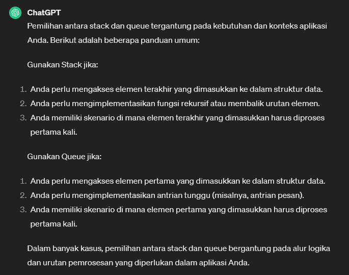
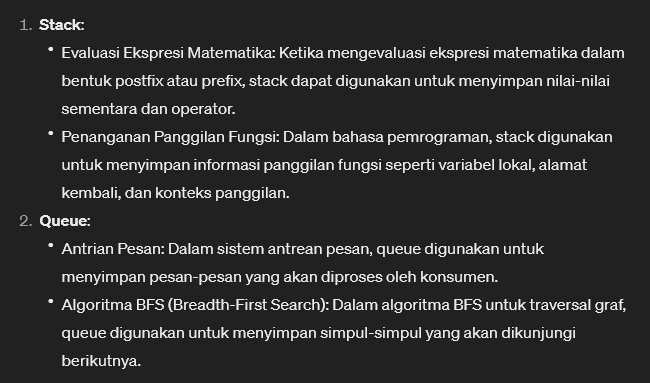

# Stacks
* struktur data yang mengikuti prinsip **LIFO (Last-In-First-Out)**, yang berarti elemen terakhir yang dimasukkan ke dalam stack akan menjadi elemen pertama yang keluar. Operasi pada stack umumnya terbatas pada dua operasi utama: `push`, untuk menambahkan elemen ke stack, dan `pop`, untuk menghapus elemen teratas dari stack.

```csharp
using System;
using System.Collections;

namespace LearnStacks
{
    public class Program
    {
        static void Main(string[] args) 
        {
            // Last In First Out
            Stack stack = new Stack();
            stack.Push(1);
            stack.Push(2);
            stack.Push(3);

            Console.WriteLine("Peek 1: {0}", stack.Peek());
            Console.WriteLine("Pop 1: {0}", stack.Pop());

            Console.WriteLine("Contain 1: {0}", stack.Contains(1));

            // copy stack into array
            object[] numArray2 = stack.ToArray();

            Console.WriteLine(String.Join(",", numArray2));

            foreach (object o in stack)
            {
                Console.WriteLine($"Stack: {o}");
            }
        }
    }
}
```


Hasil: <br>
```terminal
Peek 1: 3
Pop 1: 3
Contain 1: True
2,1
Stack: 2
Stack: 1
```


## About Stack & Queue

When to use stack & queue? <br>


Example Real case of stack & queue: <br>
 


[<- back](https://github.com/QuackPlayground/csharp/blob/main/theory/basic/26.md)
[continue ->](https://github.com/QuackPlayground/csharp/blob/main/theory/basic/28.md)