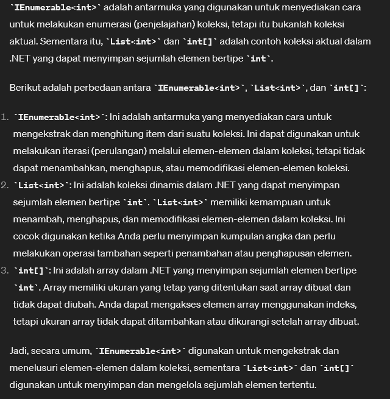

# Lambda

* sebuah fitur dalam bahasa pemrograman C# yang memungkinkan kita untuk menulis fungsi anonim dalam kode kita. 
* Fungsi anonim adalah fungsi yang tidak memiliki nama dan biasanya digunakan sebagai argumen untuk metode lain atau untuk membuat ekspresi yang lebih ringkas.
* Lambda digunakan untuk membuat ekspresi lambda, yang merupakan cara singkat untuk menulis fungsi anonim
* Ekspresi lambda biasanya digunakan dalam kombinasi dengan metode LINQ (Language Integrated Query) untuk menyederhanakan kode dalam operasi-operasi seperti pemetaan, penyaringan, dan pengurutan koleksi data.

Format umum lambda expression: `(input parameters) => expression`

# `.Where`
* adalah metode ekstensi yang digunakan dalam LINQ (Language Integrated Query) untuk melakukan operasi penyaringan (filtering) pada koleksi data. Metode ini memungkinkan Anda untuk mengambil elemen-elemen dari koleksi yang memenuhi kondisi tertentu yang Anda tentukan.


# Implementasi

```csharp
using System.Globalization;
using System.Text;
using System.Collections;
using System.Collections.Generic;
using System.ComponentModel.DataAnnotations;

namespace csharpfeat01
{
    public class Program
    {

        delegate double doubleIt(double val);

        static void Main(string[] args)
        {
            // Lambda: allows to use anonymous that defines input on the left and execute on the right

            doubleIt dblIt = x => x * 2;
            Console.WriteLine($"5 * 2 = {dblIt(5)}");

            // u don't have to use delegates
            List<int> numList = new List<int> { 1, 9, 2, 6, 3};

            // Menggunakan .ToList()
            var evenListToList = numList.Where(a => a % 2 == 0).ToList();

            // Tanpa .ToList()
            var evenListNoToList = numList.Where(a => a % 2 == 0);

            Console.WriteLine("Using .ToList():");
            foreach (var num in evenListToList)
            {
                Console.WriteLine(num);
            }

            Console.WriteLine("Without .ToList():");
            foreach (var num in evenListNoToList)
            {
                Console.WriteLine(num);
            }

            var rangeList = numList.Where(x => (x > 2) || (x < 9)).ToList();
            foreach(var j in rangeList) Console.WriteLine(j);

            List<int> flipList = new List<int>();
            int i = 0;
            Random rnd = new Random();
            while(i < 100)
            {
                flipList.Add(rnd.Next(1, 3)); // generate 1 or 2
                i++;
            }
            Console.WriteLine("Heads: {0}", flipList.Where(a => a == 1).ToList().Count());
            Console.WriteLine("Tails: {0}", flipList.Where(a => a == 2).ToList().Count());

            var nameList = new List<string> { "Doug", "Sally", "Sue" };
            var sNameList = nameList.Where(x => x.StartsWith("S"));
            foreach (var m in sNameList) Console.WriteLine(m);
        }
    }
}

```

Example Result: 
```terminal
5 * 2 = 10
Using .ToList():
2
6
Without .ToList():
2
6
1
9
2
6
3
Heads: 58
Tails: 42
Sally
Sue
```


## INFO
Perbedaan antara `IEnumerable` dengan `List` / `Array`:



[<- back](https://github.com/QuackPlayground/csharp/blob/main/theory/basic/28.md)
[continue ->](https://github.com/QuackPlayground/csharp/blob/main/theory/basic/30.md)