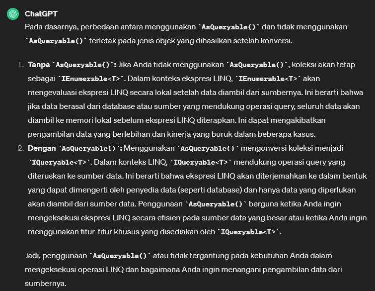
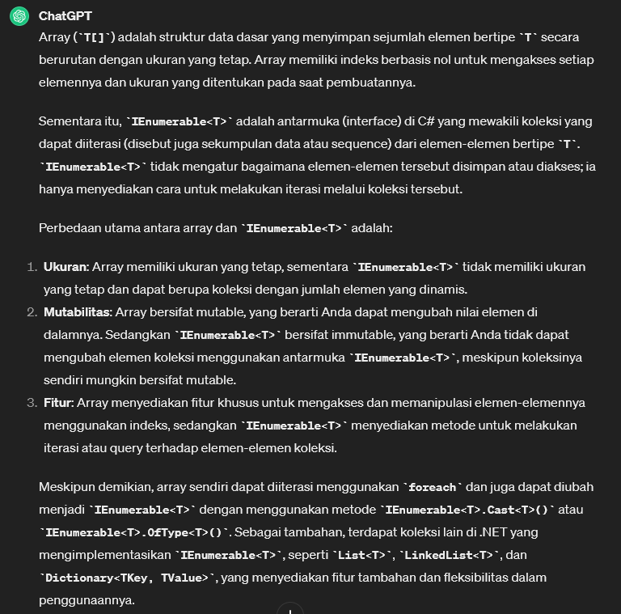

# Select & Range
* digunakan untuk mentransformasi (mengubah) setiap elemen dalam koleksi (seperti List, Array, dll.) sesuai dengan fungsi atau operasi yang ditentukan dan mengembalikan koleksi baru yang berisi hasil transformasi tersebut.
* `Range` digunakan untuk membuat koleksi berisi serangkaian bilangan bulat berurutan dalam rentang tertentu. 

```csharp
public class Program
{
    static void Main(string[] args)
    {
        var oneTo10 = new List<int>();
        oneTo10.AddRange(Enumerable.Range(1, 10));

        var squares = oneTo10.Select(x => x * x);
        foreach(var l in squares) Console.WriteLine(l);
    }
}
```

Hasil: <br>
```terminal
1
4
9
16
25
36
49
64
81
100
```


# Zip
* digunakan untuk menggabungkan dua koleksi menjadi satu koleksi baru dengan menggabungkan elemen-elemen yang memiliki indeks yang sama. 
* Artinya, Zip akan mengambil elemen pertama dari koleksi pertama dan menggabungkannya dengan elemen pertama dari koleksi kedua, elemen kedua dengan elemen kedua, dan seterusnya.

```csharp
namespace csharpfeat02
{
    public class Program
    {
        static void Main(string[] args)
        {
            var listOne = new List<int>(new int[] {1, 3, 4});
            var listTwo = new List<int>(new int[] {4, 6, 8});

            var sumList = listOne.Zip(listTwo, (x, y) => x + y).ToList();
            foreach(var item in sumList) Console.WriteLine(item);
        }
    }
}

```


Hasil:
```terminal
5
9
12
```


# Aggregate 
* digunakan untuk menggabungkan semua elemen dalam koleksi menjadi satu nilai tunggal. 
* Metode ini menerima sebuah fungsi (delegate) yang menentukan cara menggabungkan elemen-elemen tersebut. 
* Fungsi ini biasanya memiliki dua parameter: nilai akumulator (hasil gabungan sejauh ini) dan elemen berikutnya dalam iterasi.
* sama seperti `.reduce()` di bahasa pemrograman javascript

# Average
* digunakan untuk menghitung rata-rata dari nilai-nilai dalam koleksi. 
* Metode ini mengembalikan nilai rata-rata dari elemen-elemen koleksi yang sesuai dengan tipe numerik tertentu.

Benefit `.AsQueryable()`:
 

# All
*  digunakan untuk menentukan apakah semua elemen dalam koleksi memenuhi kondisi yang ditentukan oleh sebuah predikat (fungsi delegat).

# Any
* digunakan untuk memeriksa apakah koleksi memiliki setidaknya satu elemen yang memenuhi kondisi yang ditentukan oleh sebuah predikat (fungsi delegat).
* Metode ini mengembalikan nilai boolean true jika setidaknya satu elemen memenuhi kondisi, dan false jika tidak ada elemen yang memenuhi kondisi.

# Distinct
* digunakan untuk mengembalikan elemen-elemen unik **(tidak ada duplikat)** dari koleksi. 
* Metode ini membandingkan elemen-elemen menggunakan metode Equals secara default untuk menentukan apakah dua elemen dianggap sama.

# Except
* digunakan untuk mengembalikan elemen-elemen yang ada di koleksi pertama namun tidak ada di koleksi kedua

# Intersect
* untuk mengambil elemen elemen yang ada di kedua koleksi


# Implementasi Kode
```csharp
using System;

namespace csharpfeat02
{
    public class Program
    {

        delegate double doubleIt(double val);

        static void Main(string[] args)
        {
            var numList2 = new List<int>() {1, 2, 3, 4, 5};

            foreach (var num in numList2) Console.WriteLine(num);

            Console.WriteLine("Sum {0}",
                numList2.Aggregate((a, b) => a + b));

            Console.WriteLine("Average {0}",
                numList2.AsQueryable().Average());

            Console.WriteLine("Is All > 3: {0}",
                numList2.All(x => x > 3)); // false

            Console.WriteLine("Any > 3: {0}",
                numList2.Any(x => x > 3)); // true

            var numList3 = new List<int>() { 1, 2, 3, 3, 2, 3 };
            Console.WriteLine("Distinct: {0}",
                string.Join(", ", numList3.Distinct())); // 1, 2, 3

            var numList4 = new List<int>() { 3 };
            // Mengambil elemen-elemen yang ada di numList3 namun tidak ada di numList4
            Console.WriteLine("Except: {0}",
                string.Join(", ", numList3.Except(numList4))); // 1, 2

            Console.WriteLine("Intersect: {0}",
                string.Join(", ", numList3.Intersect(numList4))); // 3

        }
    }
}
```

Hasil:
```terminal
1
2
3
4
5
Sum 15
Average 3
Is All > 3: False
Any > 3: True
Distinct: 1, 2, 3
Except: 1, 2
Intersect: 3
```


## INFO Perbedaan Array vs IEnumerable



[<- back](https://github.com/QuackPlayground/csharp/blob/main/theory/basic/29.md)
[continue ->](https://github.com/QuackPlayground/csharp/blob/main/theory/basic/31.md)