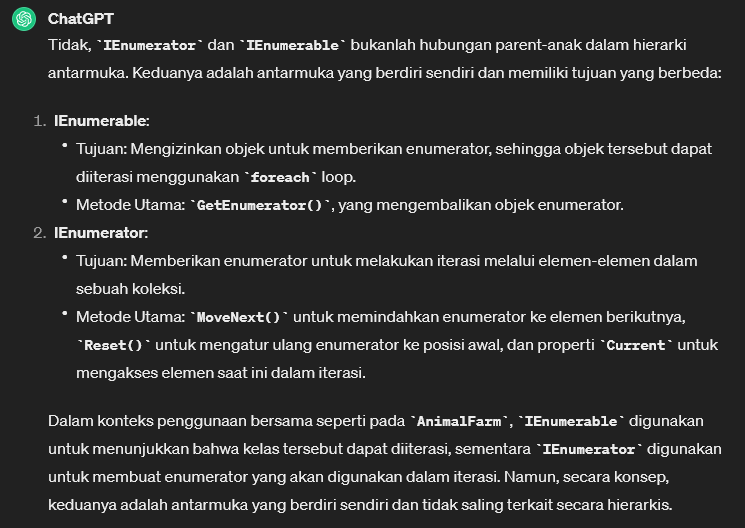
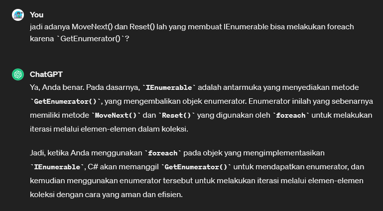
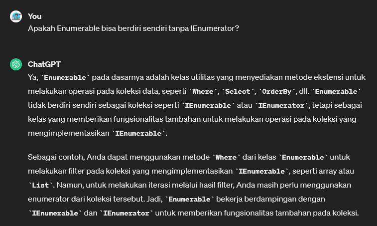
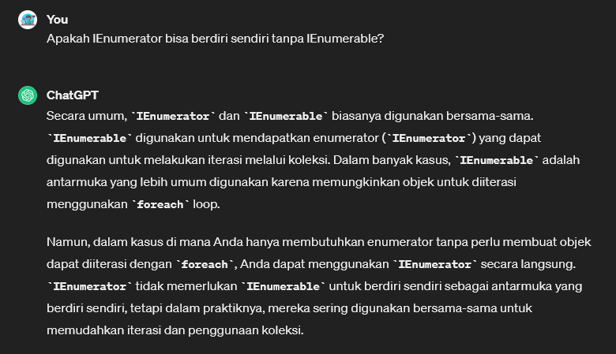

# IEnumerator
* antarmuka (interface) di C# yang digunakan untuk mengakses elemen secara sekuensial dalam koleksi yang tidak dapat diubah (immutable collection) atau koleksi yang tidak memiliki indeks, seperti `IEnumerable`
* Antarmuka `IEnumerator` menyediakan dua metode utama: `MoveNext()` untuk memindahkan enumerator ke elemen berikutnya dalam koleksi, dan `Reset()` untuk mengatur enumerator kembali ke posisi awal sebelum elemen pertama dalam koleksi.


**Perbedaan `IEnumerator` dengan `IEnumerable`:** 
> `IEnumerable` adalah antarmuka yang menyediakan metode untuk mendapatkan enumerator (IEnumerator), sementara `IEnumerator` adalah antarmuka yang menyediakan metode untuk mengakses elemen dalam koleksi secara sekuensial. Dalam penggunaan praktis, `IEnumerable` biasanya digunakan secara lebih umum karena memungkinkan iterasi mudah melalui koleksi menggunakan `foreach` loop, sementara `IEnumerator` digunakan secara lebih khusus ketika Anda perlu mengontrol aliran iterasi secara manual. Contoh penggunaan `IEnumerator`: pada linkedlist

sekilas tentang `Reset`: 
> Metode `Reset()` ini akan mengatur ulang posisi enumerator ke nilai -1, sehingga ketika MoveNext() dipanggil kembali, enumerator akan mulai dari awal dari elemen pertama dalam koleksi.

-------

> Animal.cs

```csharp
namespace csharpfeat03
{
    class Animal
    {
        public string Name {  get; set; }

        public Animal(string name = "No Name")
        {
            Name = name;
        }
    }
}

```

> AnimalFarm.cs

```csharp
using System;
using System.Collections;
using System.Collections.Generic;
using System.Linq;
using System.Text;
using System.Threading.Tasks;

namespace csharpfeat03
{
    class AnimalFarm : IEnumerable 
    {
        private List<Animal> animalList = new List<Animal>();

        public AnimalFarm(List<Animal> animalList)
        {
            this.animalList = animalList;
        }

        public AnimalFarm() { }

        // we will create an indexer so we could sort throught our list
        // Indexer digunakan untuk memberikan akses indeks ke objek, mirip dengan penggunaan indeks pada array
        public Animal this[int index]
        {
            get { return (Animal)animalList[index]; }
            set { animalList.Insert(index, value); }
        }

        // get number the animals that store
        public int Count
        {
            get { return animalList.Count; }
        }

        public IEnumerator GetEnumerator()
        {
            // return enumerator that will be used to iterate through our Animal Collection
            return animalList.GetEnumerator();
        } 
    }
}

```

--------

> Program.cs
```csharp
using System;

namespace csharpfeat03
{
    public class Program
    {
        static void Main(string[] args)
        {
            AnimalFarm myAnimals = new AnimalFarm();
            myAnimals[0] = new Animal("Wilbur");
            myAnimals[1] = new Animal("Templeton");
            myAnimals[2] = new Animal("Gander");
            myAnimals[3] = new Animal("Charlotte");

            foreach(Animal i in myAnimals) Console.WriteLine(i.Name);

            // That is how to create very customize collection types
        }
    }
}
```

Hasil: <br>
```terminal
Wilbur
Templeton
Gander
Charlotte
```

## INFO `IEnumerable` & `IEnumerator`

 <br>

 <br>

 <br>

 


[<- back](https://github.com/QuackPlayground/csharp/blob/main/theory/basic/30.md)
[continue ->](https://github.com/QuackPlayground/csharp/blob/main/theory/basic/32.md)