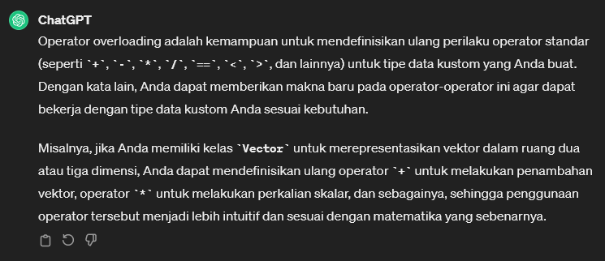

# Operator Overloading
* [Dokumentasi Operator Overloading](https://www.geeksforgeeks.org/c-sharp-operator-overloading/)

 <br>

> Box.cs

```csharp
using System;
using System.Collections.Generic;
using System.Linq;
using System.Text;
using System.Threading.Tasks;

namespace csharpfeat03
{
    class Box
    {
        public double Length { get; set; }
        public double Width { get; set; }
        public double Breadth { get; set; } 

        public Box() : this(1, 1, 1) { } // default constructor

        public Box(double length, double width, double breadth)
        {
            Length = length;
            Width = width;
            Breadth = breadth; // kedalaman objek 
        }

        // operator overloading
        public static Box operator +(Box box1, Box box2)
        {
            // add two box together
            Box box = new Box()
            {
                Length = box1.Length + box2.Length,
                Width = box1.Width + box2.Width,
                Breadth = box1.Breadth + box2.Breadth
            };

            return box;
        }

        // You can overload +, -, *, /, %, !, ==, !=, >, <, >=, <=, ++, and --
        public static Box operator -(Box box1, Box box2)
        {
            Box box = new Box()
            {
                Length = box1.Length - box2.Length,
                Width = box1.Width - box2.Width,
                Breadth = box1.Breadth - box2.Breadth
            };

            return box;
        }

        public static bool operator ==(Box box1, Box box2)
        {
            if((box1.Length == box2.Length) && 
                (box1.Width == box2.Width) && 
                (box1.Breadth == box2.Breadth))
            {
                return true;
            }
            return false;
        }

        public static bool operator !=(Box box1, Box box2)
        {
            if ((box1.Length != box2.Length) ||
                (box1.Width != box2.Width) ||
                (box1.Breadth != box2.Breadth))
            {
                return true;
            }
            return false;
        }

        // customize output
        public override string ToString()
        {
            return String.Format("Box with length: {0}, width: {1}, breadth: {2}",
                Length, Width, Breadth);
        }

        // convert Box to another data type
        public static explicit operator int(Box b)
        {
            return (int)((b.Length + b.Width + b.Breadth) / 3);
        }

        // conver int to Box
        public static implicit operator Box(int i) 
        {
            return new Box(i, i, i);
        }
    }
}

```

---------

> Program.cs

```csharp
using System;

namespace csharpfeat03
{
    public class Program
    {
        static void Main(string[] args)
        {
            //----------------------------
            Console.WriteLine("\n");

            Box box1 = new Box(2, 3, 4);
            Box box2 = new Box(5, 6, 7);
            Box box3 = box1 + box2;

            Console.WriteLine($"Box 3: {box3}");
            Console.WriteLine($"Box Int: {(int)box3}");

            Box box4 = (Box)4;
            Console.WriteLine($"Box 4: {box4}");
        }
    }
}
```


Hasil:

```terminal
Box 3: Box with length: 7, width: 9, breadth: 11
Box Int: 9
Box 4: Box with length: 4, width: 4, breadth: 4
```


[<- back](https://github.com/QuackPlayground/csharp/blob/main/theory/basic/31.md)
[continue ->](https://github.com/QuackPlayground/csharp/blob/main/theory/basic/33.md)