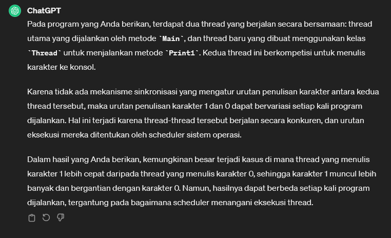

# Threads
* Threading in C# is all about executing multiple processes or tasks at the same time
* [Artikel Threads in C#](https://www.bytehide.com/blog/threads-csharp)

## Threads Part 1

> Program.cs
```csharp
using System;
using System.Linq;
using System.Collections;
using System.Collections.Generic;
using System.ComponentModel.DataAnnotations;
using System.Diagnostics;
using System.Xml.Linq;


namespace csharpfeat04
{
    public class Program
    {

        static void Print1()
        {
            for (int i = 0; i < 1000; i++) 
            {
                Console.Write(1);
            }
        }

        static void Main(string[] args) 
        {
            Thread t = new Thread(Print1);
            t.Start(); // try to print thousand of 1

            for (int i = 0; i < 1000; i++)
            {
                Console.Write(0);
            }
        }
    }
}

```

Hasil: <br>
 

-------------------------------
## Threads Part 2 (Threads Sleep)
* is going to suspend the execution for certain of time


[<- back](https://github.com/QuackPlayground/csharp/blob/main/theory/basic/34.md)
[continue ->](https://github.com/QuackPlayground/csharp/blob/main/theory/basic/36.md)