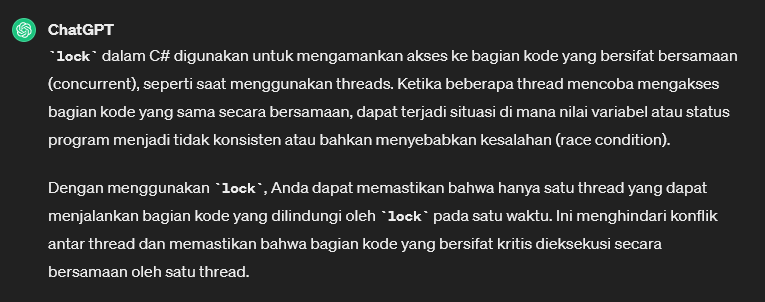
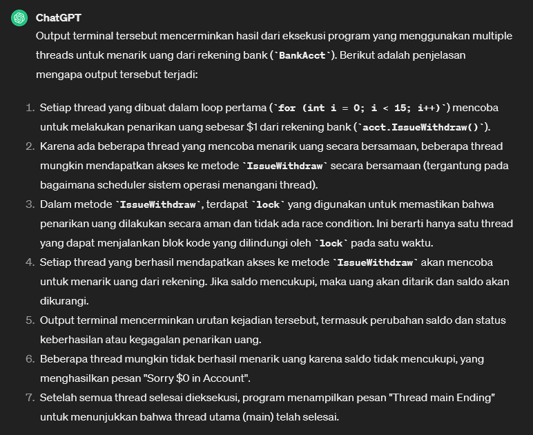
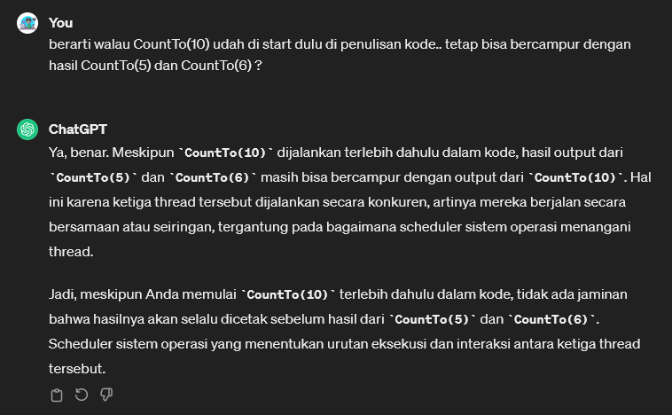

# Threads
* Threading in C# is all about executing multiple processes or tasks at the same time
* [Artikel Threads in C#](https://www.bytehide.com/blog/threads-csharp)

## Threads Part 1

> Program.cs
```csharp
using System;
using System.Linq;
using System.Collections;
using System.Collections.Generic;
using System.ComponentModel.DataAnnotations;
using System.Diagnostics;
using System.Xml.Linq;


namespace csharpfeat04
{
    public class Program
    {

        static void Print1()
        {
            for (int i = 0; i < 1000; i++) 
            {
                Console.Write(1);
            }
        }

        static void Main(string[] args) 
        {
            Thread t = new Thread(Print1);
            t.Start(); // try to print thousand of 1

            for (int i = 0; i < 1000; i++)
            {
                Console.Write(0);
            }
        }
    }
}

```

Hasil: <br>
 

-------------------------------
## Threads Part 2 (Threads Sleep)
* is going to suspend the execution for certain of time

```csharp
static void Main(string[] args) 
{
    int num = 1;

    for (int i = 0; i < 10; i++) 
    { 
        Console.WriteLine(num);
        Thread.Sleep(1000); // pause 1s
        num++;
    }

    Console.WriteLine("Thread Ends");
}
```

Hasil: 
```terminal
1
2
3
4
5
6
7
8
9
10
Thread Ends
```
* akan muncul dengan interval 1s tiap barisnya

------------------------

## Threads Part 3 (`lock`)

 <br>

> BankAcct.cs
```csharp
using System;
using System.Collections.Generic;
using System.Linq;
using System.Text;
using System.Threading.Tasks;

namespace csharpfeat04
{
    class BankAcct
    {
        private Object acctLock = new object();
        double Balance {  get; set; }
        string Name {  get; set; }

        public BankAcct (double bal)
        {
            Balance = bal;
        }

        public double Withdraw(double amt)
        {
            if ((Balance - amt) < 0)
            {
                Console.WriteLine($"Sorry ${Balance} in Account");
                return Balance;
            }

            // we can take the mony
            lock (acctLock)
            {
                if (Balance >= amt) 
                {
                    Console.WriteLine("Remove {0} and {1} left in account",
                        amt, (Balance - amt));
                    Balance -= amt;
                }
                return Balance;
            }
        }

        public void IssueWithdraw()
        {
            Withdraw(1);
        }
    }
}

```

* Dalam kode tersebut, `lock` digunakan untuk mengamankan akses ke bagian kode yang melibatkan operasi yang bersifat kritis (critical section), yaitu operasi yang harus dieksekusi secara utuh tanpa gangguan dari thread lain. Dalam hal ini, operasi yang bersifat kritis adalah pengecekan saldo dan penarikan uang dalam metode Withdraw.
* Tanpa `lock`, ada kemungkinan dua thread dapat menjalankan metode Withdraw secara bersamaan dan menemui kondisi balik (race condition), yang dapat menyebabkan ketidaksempurnaan dalam pengurangan saldo. Dengan menggunakan `lock`, kita memastikan bahwa hanya satu thread yang dapat menjalankan blok yang dilindungi oleh `lock` pada satu waktu, sehingga menghindari masalah tersebut.
* Dengan kata lain, `lock` digunakan dalam kode tersebut untuk menjaga kebenaran operasi penarikan uang dari rekening bank, sehingga saldo yang tersedia selalu diupdate secara benar dan tidak ada dua thread yang dapat mengurangi saldo secara bersamaan.

* `lock` digunakan untuk memastikan bahwa blok kode yang dilindungi oleh `lock` dieksekusi oleh hanya satu thread pada satu waktu. Jika suatu thread mencoba mengakses blok yang dilindungi oleh `lock` yang sudah diambil oleh thread lain, thread tersebut akan ditunda (blocked) sampai `lock` dilepaskan oleh thread yang pertama.

> Program.cs
```csharp
using System;
using System.Linq;
using System.Collections;
using System.Collections.Generic;
using System.ComponentModel.DataAnnotations;
using System.Diagnostics;
using System.Xml.Linq;


namespace csharpfeat04
{
    public class Program
    {

        static void Main(string[] args) 
        {
            BankAcct acct = new BankAcct(10);
            Thread[] threads = new Thread[15];

            Thread.CurrentThread.Name = "main"; // Memberi nama thread utama (main) sebagai "main".

            // Loop untuk membuat 15 thread baru.
            for (int i = 0; i < 15; i++)
            {
                Thread t = new Thread(new ThreadStart(acct.IssueWithdraw));
                t.Name = i.ToString(); // Memberi nama thread sesuai dengan indeksnya dalam loop.
                threads[i] = t;
            }

            // Loop untuk memulai dan menampilkan status 15 thread yang telah dibuat.
            for (int i = 0; i < 15; i++)
            {
                Console.WriteLine("Thread {0} Alive: {1}", threads[i].Name, threads[i].IsAlive); // Menampilkan status (hidup/mati) dari thread dengan nama dan status IsAlive yang sesuai.
                threads[i].Start(); // Memulai eksekusi thread.

                Console.WriteLine("Thread {0} Alive: {1}", threads[i].Name, threads[i].IsAlive); // Menampilkan status setelah thread dimulai.
            }

            Console.WriteLine("Current Priority: {0}", Thread.CurrentThread.Priority); // Menampilkan prioritas thread utama.
            Console.WriteLine("Thread {0} Ending", Thread.CurrentThread.Name); // Menampilkan bahwa thread utama telah selesai.
        }
    }
}

```

Example Output: 

```terminal
Thread 0 Alive: False
Thread 0 Alive: True
Thread 1 Alive: False
Thread 1 Alive: True
Thread 2 Alive: False
Thread 2 Alive: True
Thread 3 Alive: False
Remove 1 and 9 left in account
Thread 3 Alive: True
Thread 4 Alive: False
Remove 1 and 8 left in account
Remove 1 and 7 left in account
Thread 4 Alive: True
Thread 5 Alive: False
Remove 1 and 6 left in account
Remove 1 and 5 left in account
Thread 5 Alive: True
Thread 6 Alive: False
Remove 1 and 4 left in account
Thread 6 Alive: True
Thread 7 Alive: False
Remove 1 and 3 left in account
Thread 7 Alive: True
Thread 8 Alive: False
Remove 1 and 2 left in account
Thread 8 Alive: True
Thread 9 Alive: False
Remove 1 and 1 left in account
Thread 9 Alive: True
Thread 10 Alive: False
Remove 1 and 0 left in account
Thread 10 Alive: True
Thread 11 Alive: False
Sorry $0 in Account
Thread 11 Alive: True
Thread 12 Alive: False
Sorry $0 in Account
Thread 12 Alive: True
Thread 13 Alive: False
Sorry $0 in Account
Thread 13 Alive: True
Thread 14 Alive: False
Sorry $0 in Account
Thread 14 Alive: True
Sorry $0 in Account
Current Priority: Normal
Thread main Ending
```

Penjelasan: <br>
  

------------------------------------

## Threads Part 4

> Program.cs
```csharp
using System;
using System.Linq;
using System.Collections;
using System.Collections.Generic;
using System.ComponentModel.DataAnnotations;
using System.Diagnostics;
using System.Xml.Linq;


namespace csharpfeat04
{
    public class Program
    {

        static void CountTo(int maxNum)
        {
            for(int i = 0; i <= maxNum; i++) 
            {
                Console.WriteLine(i);
            }
        }

        static void Main(string[] args) 
        {
            Thread t = new Thread(() => CountTo(10));
            t.Start();

            new Thread(() =>
            {
                CountTo(5);
                CountTo(6);
            }).Start();
        }
    }
}

```

Example output:
```terminal
0
1
2
3
4
5
6
7
8
9
10
0
1
2
3
4
5
0
1
2
3
4
5
6
```

Dengan menggunakan threads, kedua blok kode `CountTo(10)` dan `CountTo(5);` `CountTo(6);` dapat dijalankan secara bersamaan, sehingga outputnya mungkin akan dicampur antara kedua thread tersebut.
<br>




[<- back](https://github.com/QuackPlayground/csharp/blob/main/theory/basic/34.md)
[continue ->](https://github.com/QuackPlayground/csharp/blob/main/theory/basic/36.md)