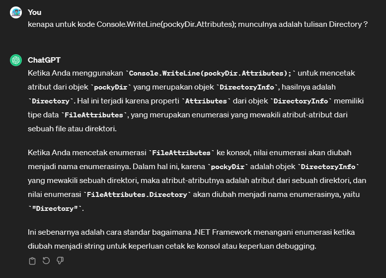

# Directory Functions
* kumpulan fungsi atau metode yang digunakan untuk bekerja dengan direktori (folder) dalam sistem file.
* Kelas ini menyediakan sejumlah metode statis yang memungkinkan Anda untuk melakukan operasi pada direktori, seperti membuat, menghapus, mengubah nama, atau mendapatkan informasi tentang sebuah direktori. 
* Beberapa metode umum:
    * `CreateDirectory(string path)`: Delete(string path): Menghapus sebuah direktori yang kosong pada path yang ditentukan.
    * `Exists(string path)`: Memeriksa apakah sebuah direktori ada atau tidak pada path yang ditentukan.
    * `GetDirectories(string path)`: Mengembalikan daftar direktori di dalam direktori yang ditentukan.
    * `GetFiles(string path)`: Mengembalikan daftar file di dalam direktori yang ditentukan.
    * `Move(string sourceDirName, string destDirName)`: Memindahkan sebuah direktori ke lokasi baru.
    * `GetCreationTime(string path)`: Mengembalikan waktu pembuatan sebuah direktori.
    * `GetLastWriteTime(string path)`: Mengembalikan waktu terakhir sebuah direktori diubah.

> Program.cs
```csharp
using System;
using System.Collections;
using System.Collections.Generic;
using System.ComponentModel.DataAnnotations;
using System.Diagnostics;
using System.Xml.Linq;
using System.IO;

namespace Chapter01
{
    public class Program
    {
        static void Main(string[] args)
        {
            DirectoryInfo currDir = new DirectoryInfo("."); // current directory
            DirectoryInfo pockyDir = new DirectoryInfo(@"D:\ngulik\QuackPlayground");

            Console.WriteLine(currDir.FullName);

            Console.WriteLine(pockyDir.FullName); // D:\ngulik\QuackPlayground
            Console.WriteLine(pockyDir.Name); // QuackPlayground
            Console.WriteLine(pockyDir.Parent); // D:\ngulik
            Console.WriteLine(pockyDir.Attributes); // Directory
            Console.WriteLine(pockyDir.CreationTime); // 08/01/2024 12:33:23

            DirectoryInfo dataDir = new DirectoryInfo(@"D:\ngulik\QuackPlayground\dummyCsharpData");
            dataDir.Create();

            //untuk hapus directory
            Directory.Delete(@"D:\ngulik\QuackPlayground\dummyCsharpData");
        }
    }
}

```


Example Result:
```terminal
D:\ngulik\QuackPlayground\csharp\fileio-serialization\chapter01\bin\Debug\net8.0
D:\ngulik\QuackPlayground
QuackPlayground
D:\ngulik
Directory
08/01/2024 12:33:23
```

dan akan ada folder yang terbentuk (hasil line kode terakhir): <br>


<br>

Sekilas Info: <br>
 <br>

-------------------------------


[<- back](https://github.com/QuackPlayground/csharp/blob/main/theory/basic/35.md)
[continue ->](https://github.com/QuackPlayground/csharp/blob/main/theory/basic/37.md)