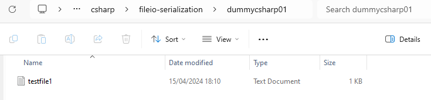

# File I/O

```csharp
using System;
using System.Collections;
using System.Collections.Generic;
using System.ComponentModel.DataAnnotations;
using System.Diagnostics;
using System.Xml.Linq;
using System.IO;

namespace Chapter01
{
    public class Program
    {
        static void Main(string[] args)
        {
            DirectoryInfo currDir = new DirectoryInfo("."); // current directory
            DirectoryInfo pockyDir = new DirectoryInfo(@"D:\ngulik\QuackPlayground");

            Console.WriteLine(currDir.FullName);

            Console.WriteLine(pockyDir.FullName); // D:\ngulik\QuackPlayground
            Console.WriteLine(pockyDir.Name); // QuackPlayground
            Console.WriteLine(pockyDir.Parent); // D:\ngulik
            Console.WriteLine(pockyDir.Attributes); // Directory
            Console.WriteLine(pockyDir.CreationTime); // 08/01/2024 12:33:23

            DirectoryInfo dataDir = new DirectoryInfo(@"D:\ngulik\QuackPlayground\csharp\fileio-serialization\dummycsharp01");
            dataDir.Create();

            string[] customers =
            {
                "Bob Smith",
                "Sally Smith",
                "Robert Smith"
            };

            string textFilePath = @"D:\ngulik\QuackPlayground\csharp\fileio-serialization\dummycsharp01\testfile1.txt";

            // write array to file
            File.WriteAllLines(textFilePath, customers);

            // read string from file
            foreach(string cust in File.ReadAllLines(textFilePath)) 
            {
                Console.WriteLine($"Customer: {cust}");
            }


            DirectoryInfo myDataDir = new DirectoryInfo(@"D:\ngulik\QuackPlayground\csharp\fileio-serialization\dummycsharp01");

            FileInfo[] txtFiles = myDataDir.GetFiles("*.txt",
                SearchOption.AllDirectories);

            Console.WriteLine("Matches: {0}", txtFiles.Length);
            
            foreach(FileInfo file in txtFiles) 
            {
                Console.WriteLine(file.Name);
                Console.WriteLine(file.Length); // file size in bytes
            }

        }
    }
}

```


Example Result:
```terminal
D:\ngulik\QuackPlayground\csharp\fileio-serialization\chapter01\bin\Debug\net8.0
D:\ngulik\QuackPlayground
QuackPlayground
D:\ngulik
Directory
08/01/2024 12:33:23
Customer: Bob Smith
Customer: Sally Smith
Customer: Robert Smith
Matches: 1
testfile1.txt
38
```

file testfile1.txt pun juga terbentuk di dalam folder yang sudah ditentukan: <br>



[<- back](https://github.com/QuackPlayground/csharp/blob/main/theory/basic/36.md)
[continue ->](https://github.com/QuackPlayground/csharp/blob/main/theory/basic/38.md)