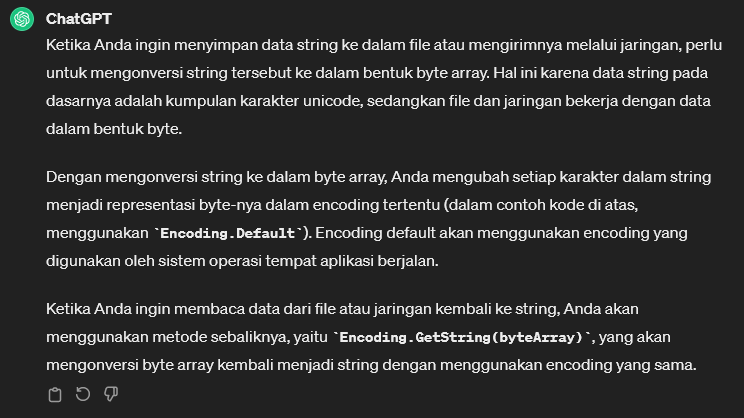

# File Streams
* File Streams (aliran file) adalah konsep dalam pemrograman yang digunakan untuk membaca atau menulis data dari atau ke file. 
* File Streams memungkinkan aplikasi untuk berinteraksi dengan file secara berurutan atau acak, dan membaca atau menulis data dalam ukuran yang diinginkan.
* Dalam pemrograman C# (dan banyak bahasa pemrograman lainnya), File Streams sering diimplementasikan menggunakan kelas FileStream yang disediakan dalam namespace `System.IO`. 
* FileStream memungkinkan kita untuk membuka file, membaca data dari file, menulis data ke file, dan menutup file setelah selesai.

```csharp
using System;
using System.Collections;
using System.Collections.Generic;
using System.ComponentModel.DataAnnotations;
using System.Diagnostics;
using System.Xml.Linq;
using System.IO;
using System.Text;


namespace Chapter02
{
    public class Program
    {
        static void Main(string[] args)
        {
            // FileStream to read an array of byte
            string textFilePath2 = @"D:\ngulik\QuackPlayground\csharp\fileio-serialization\dummycsharp01\testfile2.txt";
            FileStream fs = File.Open(textFilePath2,FileMode.Create); // membuka FileStream untuk menulis ke file

            string randString = "This is a random string";
            byte[] rsByteArray = Encoding.Default.GetBytes(randString); // konversi string jadi array byte

            fs.Write(rsByteArray, 0, rsByteArray.Length); // menulis array byte ke file
            fs.Position = 0; // mengatur posisi FileStream kembali ke awal file


            // baca array byte dari file
            byte[] fileByteArray = new byte[rsByteArray.Length];

            for(int i = 0; i < rsByteArray.Length; i++) 
            {
                fileByteArray[i] = (byte)fs.ReadByte();
            }

            // convert byte to string
            Console.WriteLine(Encoding.Default.GetString(fileByteArray));
            fs.Close();
        }
    }
}
```

file `testfile2.txt` berhasil terbentuk: <br>
 


Example Result:
```terminal
This is a random string
```


## Info seputar FileStreams
 <br>


[<- back](https://github.com/QuackPlayground/csharp/blob/main/theory/basic/37.md)
[continue ->](https://github.com/QuackPlayground/csharp/blob/main/theory/basic/39.md)