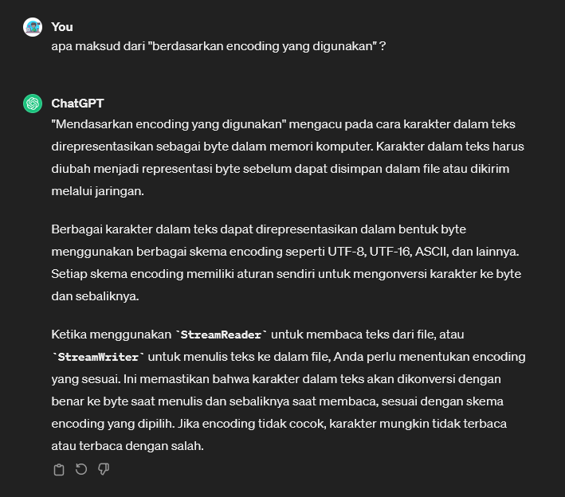
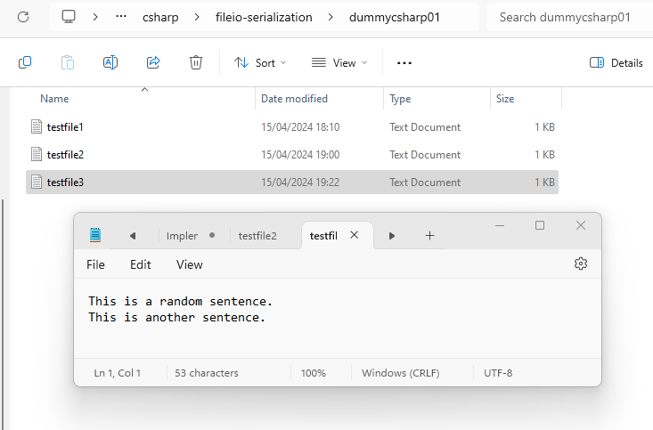

# StreamWriter / StreamReader
* adalah kelas dalam C# yang digunakan untuk menulis dan membaca teks dari file atau aliran data. 
* Kedua kelas ini merupakan bagian dari namespace System.IO dan berguna untuk operasi input/output (I/O) pada teks.
* `StreamWriter`: Digunakan untuk menulis teks ke dalam file atau aliran data. Kita dapat menggunakan StreamWriter untuk membuat file teks baru atau menulis ke file yang sudah ada.
* `StreamReader`: Digunakan untuk membaca teks dari file atau aliran data. `StreamReader` membaca data teks dari file byte-by-byte dan mengonversinya menjadi karakter berdasarkan encoding yang digunakan

Sekilas info: <br>
 

----------------------
> Program.cs
```csharp
using System;
using System.Collections;
using System.Collections.Generic;
using System.ComponentModel.DataAnnotations;
using System.Diagnostics;
using System.Xml.Linq;
using System.IO;
using System.Text;


namespace Chapter02
{
    public class Program
    {
        static void Main(string[] args)
        {
            
            string textFilePath3 = @"D:\ngulik\QuackPlayground\csharp\fileio-serialization\dummycsharp01\testfile3.txt";
            StreamWriter sw = new StreamWriter(textFilePath3);
            sw.Write("This is a random ");
            sw.WriteLine("sentence.");
            sw.WriteLine("This is another sentence.");
            sw.Close(); 

            // open file for reading
            StreamReader sr = new StreamReader(textFilePath3);
            Console.WriteLine("Peek: {0}",
                Convert.ToChar(sr.Peek()));

            Console.WriteLine("1st String: {0}",
                sr.ReadLine());

            Console.WriteLine("Everything Else: {0}",
                sr.ReadToEnd());
            sr.Close();
            
        }
    }
}
```

Hasil dari `StreamWriter`: <br>
 

Result: <br>
```terminal
Peek: T
1st String: This is a random sentence.
Everything Else: This is another sentence.
```


> Metode `Peek` digunakan untuk melihat karakter berikutnya dalam aliran tanpa membaca atau "mengonsumsi" karakter tersebut. Jadi, saat Anda memanggil Convert.ToChar(sr.Peek()), Anda hanya mendapatkan karakter berikutnya dalam aliran dan mengonversinya ke bentuk karakter sesungguhnya untuk dicetak. 


[<- back](https://github.com/QuackPlayground/csharp/blob/main/theory/basic/38.md)
[continue ->](https://github.com/QuackPlayground/csharp/blob/main/theory/basic/40.md)