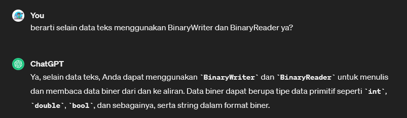
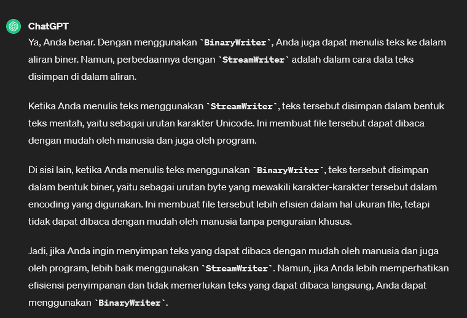
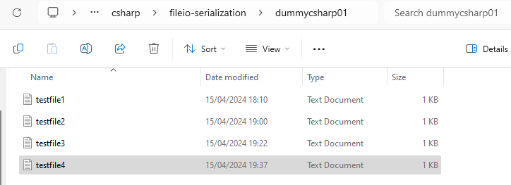

# BinaryWriter / BinaryReader
* `BinaryWriter` dan `BinaryReader` adalah kelas dalam C# yang digunakan untuk menulis dan membaca tipe data primitif (seperti `int`, `double`, `bool`, dll) ke dan dari aliran biner. 
* Mereka berbeda dengan `StreamWriter` dan `StreamReader` yang digunakan untuk menulis dan membaca teks.

**Apa perbedaan antara BinaryWriter / BinaryReader dengan StreamWriter / StreamReader?**
1. BinaryWriter dan BinaryReader
    * Digunakan untuk menulis dan membaca data biner dari dan ke aliran.
    * Dapat digunakan untuk menulis dan membaca tipe data primitif serta string ke dalam format biner.
    * Berguna untuk menyimpan dan membaca data yang tidak dalam format teks, seperti data yang diambil dari sensor, struktur data khusus, dan sebagainya.
Contoh penggunaan `BinaryWriter` untuk menulis data biner:
```csharp
using (BinaryWriter writer = new BinaryWriter(File.Open("data.bin", FileMode.Create)))
{
    writer.Write(42); // Menulis integer
    writer.Write(3.14); // Menulis double
    writer.Write("Hello, World!"); // Menulis string
}
```
Contoh penggunaan `BinaryReader` untuk membaca data biner:
```csharp
using (BinaryReader reader = new BinaryReader(File.Open("data.bin", FileMode.Open)))
{
    int intValue = reader.ReadInt32(); // Membaca integer
    double doubleValue = reader.ReadDouble(); // Membaca double
    string stringValue = reader.ReadString(); // Membaca string
}
```
2. StreamWriter dan StreamReader
    * Digunakan untuk menulis dan membaca teks dari dan ke aliran.
    * Dapat digunakan untuk menulis dan membaca data teks, seperti string dan karakter.
    * Berguna untuk menyimpan dan membaca data teks, seperti teks dalam file konfigurasi, log, dan sebagainya.

Quick Insight: <br>
 <br>

baik `StreamWriter/StreamReader` maupun `BinaryWriter/BinaryReader`, keduanya bisa untuk berurusan dengan tipe data selain teks, hanya perbedaan efisiensi penyimpanan saja: <br>


-------------

> Program.cs
```csharp
using System;
using System.Collections;
using System.Collections.Generic;
using System.ComponentModel.DataAnnotations;
using System.Diagnostics;
using System.Xml.Linq;
using System.IO;
using System.Text;


namespace Chapter02
{
    public class Program
    {
        static void Main(string[] args)
        {
            
            string textFilePath4 = @"D:\ngulik\QuackPlayground\csharp\fileio-serialization\dummycsharp01\testfile4.txt";
            FileInfo datFile = new FileInfo(textFilePath4);
            BinaryWriter bw = new BinaryWriter(datFile.OpenWrite());

            string randText = "Random Text";
            int myAge = 47;
            double height = 6.25;
            bw.Write(randText);
            bw.Write(myAge);
            bw.Write(height);
            bw.Close();

            BinaryReader br = new BinaryReader(datFile.OpenRead());
            Console.WriteLine(br.ReadString()); 
            Console.WriteLine(br.ReadInt32());
            Console.WriteLine(br.ReadDouble());
            br.Close();
                
        }
    }
}
```


File nya terbentuk, namun ketika dibuka tulisan tidak terbaca dengan jelas secara manusia karena tersimpan dalam bentuk biner: <br>



Result: 
```terminal
Random Text
47
6.25
```


[<- back](https://github.com/QuackPlayground/csharp/blob/main/theory/basic/39.md)
[continue ->](https://github.com/QuackPlayground/csharp/blob/main/theory/basic/41.md)