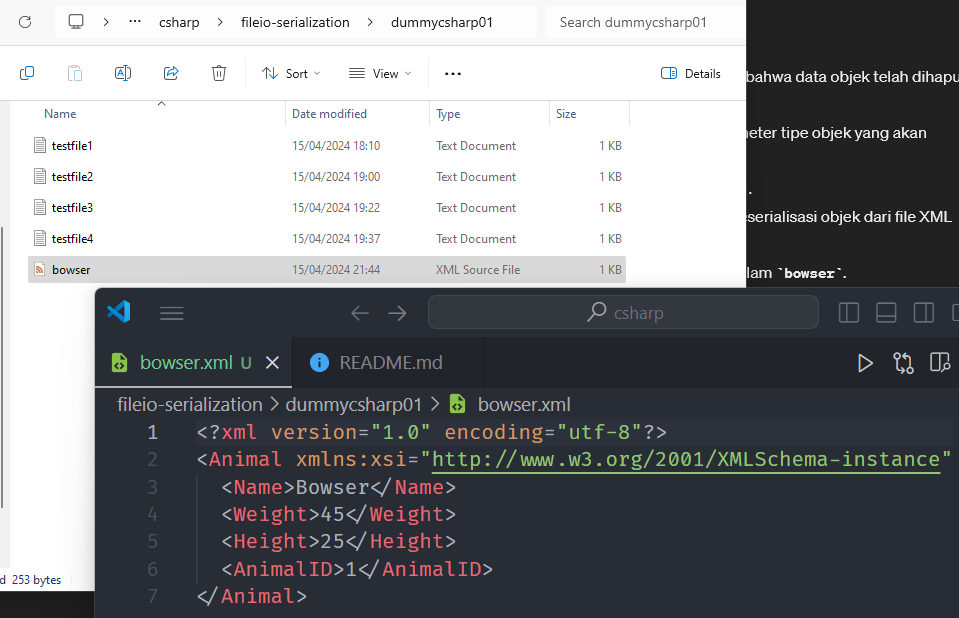
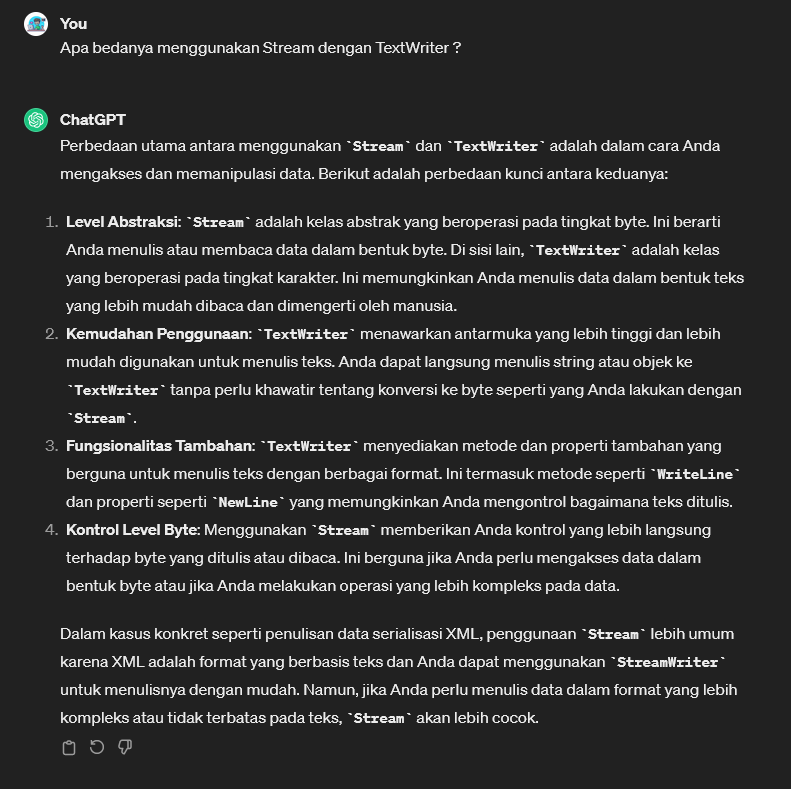
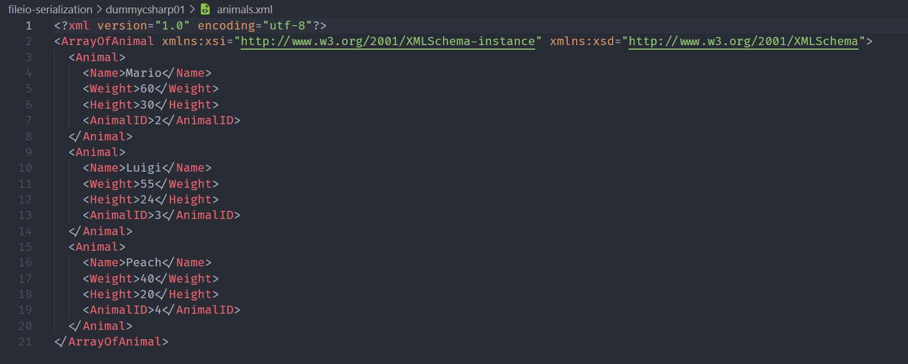

# Serialization
* proses mengubah objek atau struktur data menjadi format yang dapat disimpan atau ditransmisikan, dan kemudian mengembalikan objek atau struktur data tersebut dari format tersebut
* Tujuannya adalah untuk menyimpan objek dalam bentuk yang dapat dipindahkan atau untuk mengirimnya melalui jaringan.
* serialization sering digunakan untuk menyimpan objek ke dalam file (persistence), mengirim objek melalui jaringan (networking), atau menyimpan objek ke dalam database
* Objek yang telah diserialisasi dapat diubah kembali menjadi objek aslinya melalui proses yang disebut deserialisasi.
* Dalam C#, Anda dapat menggunakan:
    * `BinaryFormatter` untuk melakukan serialization biner, 
    * `XmlSerializer` untuk serialization XML,
    * `DataContractSerializer` untuk serialization data kontrak. 
* Dengan menggunakan serialization, Anda dapat menyimpan dan memindahkan data antar aplikasi atau platform dengan mudah.

> Serialization is to store the state of an object in a filestream and you can pass it into remote network or whatever you like

---------------

> Animal.cs

```csharp
using System;
using System.Collections.Generic;
using System.Linq;
using System.Runtime.Serialization;
using System.Text;
using System.Text.Json.Serialization;
using System.Threading.Tasks;

namespace chapter03
{
    [Serializable()]
    public class Animal : ISerializable
    {
        public string Name { get; set; }
        public double Weight { get; set; }
        public double Height { get; set; }
        public int AnimalID { get; set; }

        public Animal() { }

        public Animal(string name="No Name",
            double weight = 0,
            double height = 0,
            int animalID = 0)
        {
            Name = name;
            Weight = weight;
            Height = height;
            AnimalID = animalID;
        }

        public override string ToString()
        {
            return string.Format("{0} weights {1} lbs and is {2} inches tall",
                Name, Weight, Height);
        }

        public void GetObjectData(SerializationInfo info, StreamingContext context)
        {
            // asign key-value pair of data
            info.AddValue("Name", Name);
            info.AddValue("Weight", Weight);
            info.AddValue("Height", Height);
            info.AddValue("AnimalID", AnimalID);
        }

        
        public Animal(SerializationInfo info, StreamingContext context)
        {
            Name = (string)info.GetValue("Name", typeof(string));
            Weight = (double)info.GetValue("Weight", typeof(double));
            Height = (double)info.GetValue("Height", typeof(double));
            AnimalID = (int)info.GetValue("AnimalID", typeof(int));
        }

    }
}


```

Beberapa insight: <br>
 <br>
 <br>


Kedua namespace yaitu `System.Runtime.Serialization.Formatters.Binary` dan `System.Xml.Serialization`, menyediakan fasilitas untuk melakukan serialization objek dalam format biner (BinaryFormatter) dan format XML (XmlSerializer) secara berturut-turut.
* `BinaryFormatter` digunakan untuk menyimpan objek ke dalam format biner, yang biasanya lebih efisien untuk data yang kompleks atau besar. Data disimpan dalam format biner dapat dengan mudah dibaca kembali ke dalam objek aslinya.
* `XmlSerializer`, di sisi lain, digunakan untuk menyimpan objek dalam format XML yang lebih terbaca manusia. Ini berguna ketika Anda perlu berbagi data dengan aplikasi atau sistem yang menggunakan format XML, atau ketika Anda ingin menyimpan data dalam format yang dapat dengan mudah diubah atau diperiksa oleh manusia.

Sekarang BinaryFormatter disarankan untuk tidak digunakan. Alasannya: [link dokumentasi](https://learn.microsoft.com/id-id/dotnet/standard/serialization/binaryformatter-security-guide)

<br>

 <br>

-------------

> Program.cs

```csharp
using System;
using System.Globalization; // untuk menyediakan kelas dan fungsi-fungsi yang berkaitan dengan pengaturan regional dan budaya dalam pemrosesan teks, tanggal, dan angka. 
using System.Text;
using System.Collections;
using System.Collections.Generic;
using System.ComponentModel.DataAnnotations;
using System.Diagnostics;
using System.Xml.Linq;
using System.IO;
using System.Runtime.Serialization.Formatters.Binary;
using System.Xml.Serialization;
using chapter03;

namespace Chapter03
{
    public class Program
    {
        static void Main(string[] args)
        {
            Animal bowser = new Animal("Bowser", 45, 25, 1);
            Stream stream = File.Open("AnimalData.dat",
                FileMode.Create);

            BinaryFormatter bf = new BinaryFormatter();

            bf.Serialize(stream, bowser); // send object data to file
            stream.Close();

            // delete our data
            bowser = null;

            // read object data from file
            stream = File.Open("AnimalData.dat",
                FileMode.Open);
            bf = new BinaryFormatter();

            bowser = (Animal)bf.Deserialize(stream);
            stream.Close();

            Console.WriteLine(bowser.ToString());

        }
    }
}

```

Result: <br>


---------------------------

# XmlSerializer

> Program.cs

```csharp
using System;
using System.Globalization;
using System.Text;
using System.Collections;
using System.Collections.Generic;
using System.ComponentModel.DataAnnotations;
using System.Diagnostics;
using System.Xml.Linq;
using System.IO;
using System.Runtime.Serialization.Formatters.Binary;
using System.Xml.Serialization;
using chapter03;

namespace Chapter03
{
    public class Program
    {
        static void Main(string[] args)
        {
            Animal bowser = new Animal("Bowser", 45, 25, 1);

            XmlSerializer serializer = new XmlSerializer(typeof(Animal));
            using(TextWriter tw = new StreamWriter(@"D:\ngulik\QuackPlayground\csharp\fileio-serialization\dummycsharp01\bowser.xml"))
            {
                serializer.Serialize(tw, bowser);
            }

            bowser = null;

            // deserialize xml to object
            XmlSerializer deserializer = new XmlSerializer(typeof(Animal));
            TextReader reader = new StreamReader(@"D:\ngulik\QuackPlayground\csharp\fileio-serialization\dummycsharp01\bowser.xml");
            object obj = deserializer.Deserialize(reader);
            bowser = (Animal)obj;
            reader.Close();

            Console.WriteLine(bowser.ToString());

        }
    }
}

```


Result:
```terminal
Bowser weights 45 lbs and is 25 inches tall
```

Dan ada file xml nya juga: <br>


--------------------------

## XmlSerializer Part 2

Perbedaan `Stream` dengan `TextWriter`: <br>
 

> Program.cs

```csharp
using System;
using System.Globalization;
using System.Text;
using System.Collections;
using System.Collections.Generic;
using System.ComponentModel.DataAnnotations;
using System.Diagnostics;
using System.Xml.Linq;
using System.IO;
using System.Runtime.Serialization.Formatters.Binary;
using System.Xml.Serialization;
using chapter03;

namespace Chapter03
{
    public class Program
    {
        static void Main(string[] args)
        {

            // collection of animal
            List<Animal> theAnimals = new List<Animal>
            {
                new Animal("Mario", 60, 30, 2),
                new Animal("Luigi", 55, 24, 3),
                new Animal("Peach", 40, 20, 4)
            };

            using (Stream fs = new FileStream(@"D:\ngulik\QuackPlayground\csharp\fileio-serialization\dummycsharp01\animals.xml",
                FileMode.Create, FileAccess.Write, FileShare.None))
            {
                XmlSerializer serializer2 = new XmlSerializer(typeof(List<Animal>));
                serializer2.Serialize(fs, theAnimals);
            }

            theAnimals = null;

            XmlSerializer serializer3 = new XmlSerializer(typeof(List<Animal>));

            using (FileStream fs2 = File.OpenRead(@"D:\ngulik\QuackPlayground\csharp\fileio-serialization\dummycsharp01\animals.xml"))
            {
                theAnimals = (List<Animal>)serializer3.Deserialize(fs2);
            }

            foreach(Animal a in theAnimals)
            {
                Console.WriteLine(a.ToString());
            }
        }
    }
}
```

Result: 
```terminal
Mario weights 60 lbs and is 30 inches tall
Luigi weights 55 lbs and is 24 inches tall
Peach weights 40 lbs and is 20 inches tall
```

Dan ini adalah hasil dari list collection dalam bentuk xml: <br>



[<- back](https://github.com/QuackPlayground/csharp/blob/main/theory/basic/40.md)
[continue ->](https://github.com/QuackPlayground/csharp/blob/main/theory/basic/42.md)