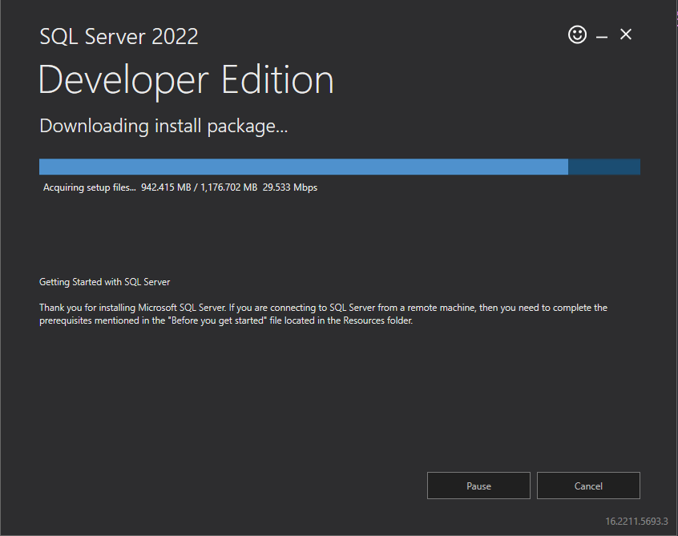
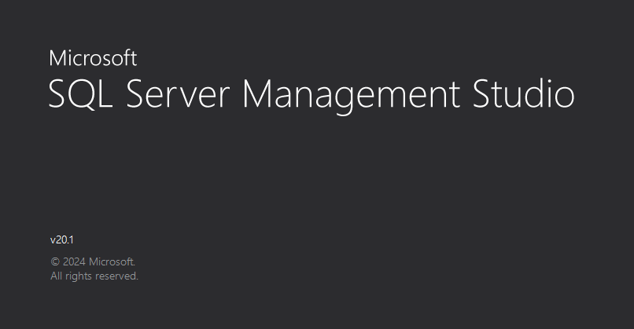
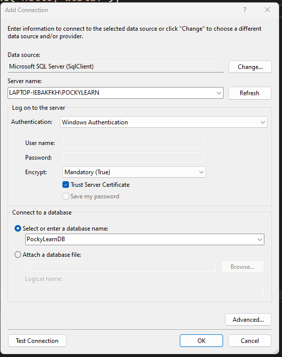
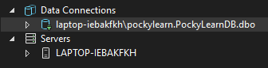
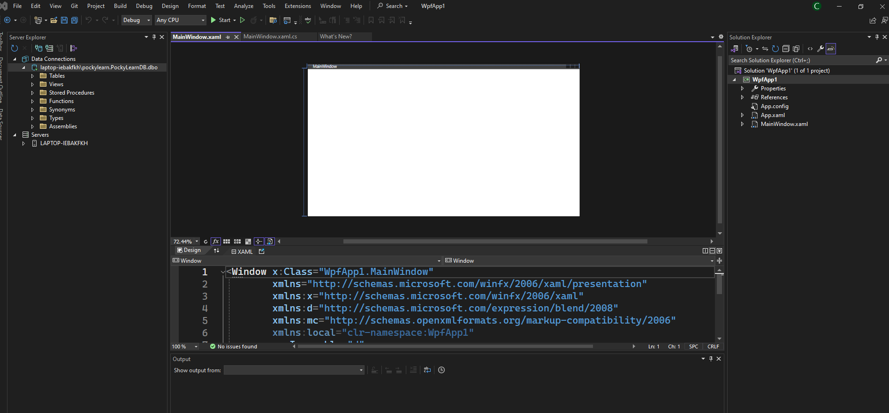

# Install SQL Server

* [Install SQL Server from this website](https://www.microsoft.com/en-us/sql-server/sql-server-downloads)
* Download for Developer
* Choose Basic 
* Accept the T&C
* Start Install SQL Server

 <br>

* [Install SQL Server Management Studio](https://learn.microsoft.com/en-us/sql/ssms/download-sql-server-management-studio-ssms?view=sql-server-ver16)

 <br>


* Create project visual studio 2022
* View > Server Explorer
* Data Connection > Add Connection..
* 

The db you enter is already there: <br>


You already have been succeed to connect your SQL Server to Visual Studio 2022

-------
# Setting Up Database

* File > New > Project
* WPF App (.NET Framework)

Setup window: <br>
 

> Bikin tabel Store

```sql
CREATE TABLE [dbo].Store
(
	[Id] INT NOT NULL PRIMARY KEY IDENTITY, 
    [Name] NVARCHAR(100) NOT NULL, 
    [Street] NVARCHAR(100) NULL,
	[City] NVARCHAR(50) NULL,
	[State] NCHAR(2) NULL,
	[Zip] INT NULL
)
```

jika sudah klik update


[<- back](https://github.com/QuackPlayground/csharp/blob/main/theory/basic/41.md)
[continue ->](https://github.com/QuackPlayground/csharp/blob/main/theory/basic/43.md)