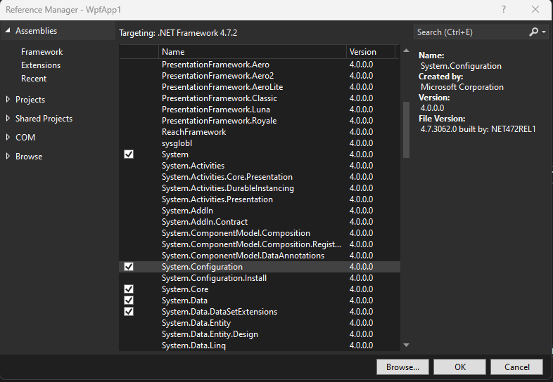
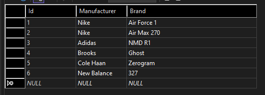
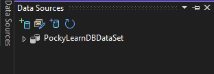
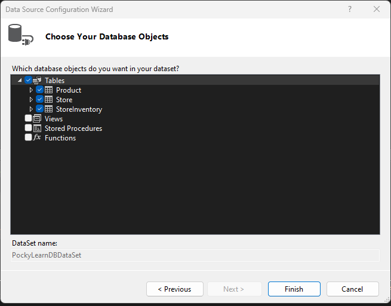
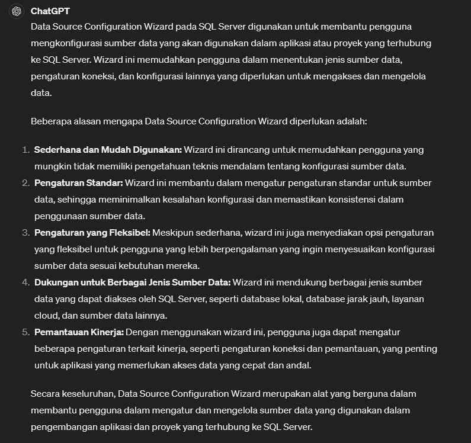
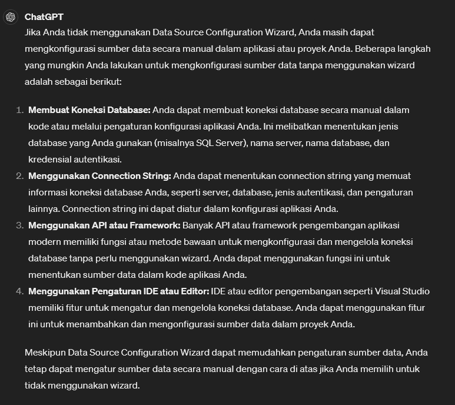
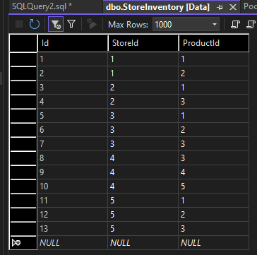
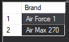

# WPF / Database Big Project
> MainWindow.xaml.cs

```csharp
using System;
using System.Collections.Generic;
using System.Linq;
using System.Text;
using System.Threading.Tasks;
using System.Windows;
using System.Windows.Controls;
using System.Windows.Data;
using System.Windows.Documents;
using System.Windows.Input;
using System.Windows.Media;
using System.Windows.Media.Imaging;
using System.Windows.Navigation;
using System.Windows.Shapes;

namespace WpfApp1
{
    /// <summary>
    /// Interaction logic for MainWindow.xaml
    /// </summary>
    public partial class MainWindow : Window
    {
        public MainWindow()
        {
            InitializeComponent();
            string connectionString = ConfigurationManager.ConnectionStrings["WpfApp1.Properties.Settings.PockyLearnDBConnectionString"].ConnectionString;
        }
    }
}

```


* references > Add references
* Add `System.Configuration`

 <br>


Tambahkan: `using System.Configuration`

----------
Mari kita tambahkan table lagi.

> Di SQL Server, `IDENTITY` digunakan untuk membuat kolom yang secara otomatis menghasilkan nilai unik untuk setiap baris yang dimasukkan ke dalam tabel. Dengan kata lain, IDENTITY digunakan untuk membuat kolom yang berfungsi sebagai primary key dengan nilai yang secara otomatis bertambah secara otomatis.

```sql
CREATE TABLE [dbo].Product
(
	[Id] INT NOT NULL PRIMARY KEY IDENTITY,
	[Manufacturer] NVARCHAR(100) NOT NULL,
	[Brand] NVARCHAR(100) NOT NULL
)
```

Lalu buat data di table product: <br>



Mari kita buat table lagi bernama `StoreInventory`


```sql
CREATE TABLE [dbo].StoreInventory
(
	[Id] INT NOT NULL PRIMARY KEY IDENTITY,
	[StoreId] INT NOT NULL,
	[ProductId] INT NOT NULL
)

```

Lalu, select WpfApp1 > Alt + Shift + D, nanti akan muncul: <br>
 


* klik kanan > Configure Data Source with Wizard..



**Kenapa harus setting data configuration wizard?** <br>
 <br>

**Manual setting without wizard** <br>
 <br>


-------
* Lalu klik kanan table store di server explorer kemudian pilih open table definition.

```sql
CREATE TABLE [dbo].StoreInventory
(
	[Id] INT NOT NULL PRIMARY KEY IDENTITY,
	[StoreId] INT NOT NULL,
	[ProductId] INT NOT NULL,
	CONSTRAINT [StoreFK] FOREIGN KEY (StoreID) REFERENCES Store(Id),
	CONSTRAINT [ProductFK] FOREIGN KEY (ProductID) REFERENCES Product(Id)
)
```

* and update the database
* kemudian isi data pada table `StoreInventory`:


Mari kita coba make sure dengan melakukan `inner join`:
```sql
SELECT p.Brand FROM Product p
INNER JOIN StoreInventory si ON p.Id = si.ProductId
WHERE si.StoreId = 1
```

select brand from the product table 
merges the storeinventory table with product table where product id = the product id for store inventory
where the storeinventory id = 1

Result: <br>
 


[<- back](https://github.com/QuackPlayground/csharp/blob/main/theory/basic/42.md)
[continue ->](https://github.com/QuackPlayground/csharp/blob/main/theory/basic/44.md)