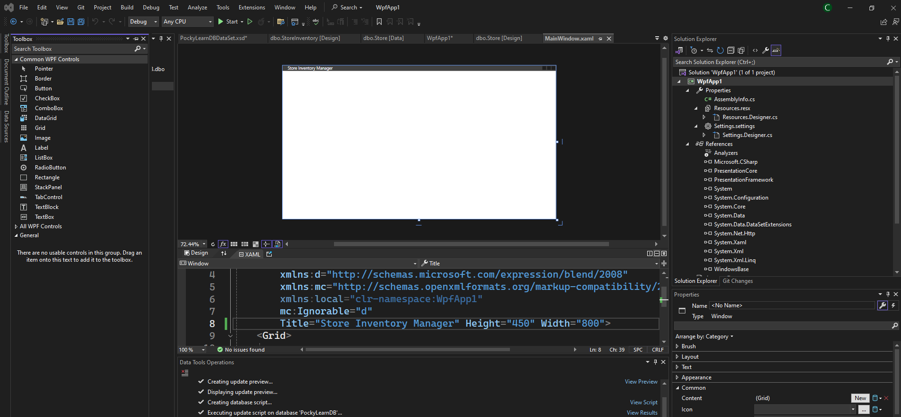
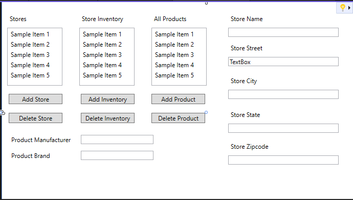

# Design An Interface
* Toolbox > Common WPF Controls
 <br>

* `Label` -> untuk judul dari masing-masing tabel
* `ListBox` -> untuk isi dari masing-masing tabel
* `Button` -> untuk buat tombol

Pembuatan interface windows app bisa dilakukan drag and drop dengan bantuan ToolBox atau bisa dengan bantuan kode XAML:
> MainWindow.xaml
```xml
<Window x:Class="WpfApp1.MainWindow"
        xmlns="http://schemas.microsoft.com/winfx/2006/xaml/presentation"
        xmlns:x="http://schemas.microsoft.com/winfx/2006/xaml"
        xmlns:d="http://schemas.microsoft.com/expression/blend/2008"
        xmlns:mc="http://schemas.openxmlformats.org/markup-compatibility/2006"
        xmlns:local="clr-namespace:WpfApp1"
        mc:Ignorable="d"
        Title="Store Inventory Manager" Height="450" Width="800">
    <Grid>
        <Label Name="storeLabel" Content="Stores" HorizontalAlignment="Left" Margin="10,20,0,0" VerticalAlignment="Top"/>
        <ListBox Name="storeList" SelectionChanged="storeList_SelectionChanged" d:ItemsSource="{d:SampleData ItemCount=5}" Margin="10,51,682,270"/>
        <Label Name="storeInvLabel" Content="Store Inventory" HorizontalAlignment="Left" Margin="151,20,0,0" VerticalAlignment="Top" Width="95"/>
        <ListBox Name="storeInventory" d:ItemsSource="{d:SampleData ItemCount=5}" Margin="151,51,541,270"/>
        <Label Name="allProductsLabel" Content="All Products" HorizontalAlignment="Left" Margin="292,20,0,0" VerticalAlignment="Top"/>
        <ListBox Name="productList" d:ItemsSource="{d:SampleData ItemCount=5}" Margin="292,51,400,270"/>
        <Button Content="Add Store" HorizontalAlignment="Left" Margin="13,180,0,0" VerticalAlignment="Top" Width="105" Click="AddStore"/>
        <Button Content="Delete Store" HorizontalAlignment="Left" Margin="13,217,0,0" VerticalAlignment="Top" Width="105" Click="DeleteStore"/>
        <Button Content="Add Inventory" HorizontalAlignment="Left" Margin="154,180,0,0" VerticalAlignment="Top" Width="105" Click="AddInventory"/>
        <Button Content="Delete Inventory" HorizontalAlignment="Left" Margin="154,217,0,0" VerticalAlignment="Top" Width="105" Click="DeleteInventory"/>
        <Button Content="Add Product" HorizontalAlignment="Left" Margin="292,180,0,0" VerticalAlignment="Top" Width="105" Click="AddProductClick"/>
        <Button Content="Delete Product" HorizontalAlignment="Left" Margin="292,217,0,0" VerticalAlignment="Top" Width="105" Click="DeleteProductClick"/>
        <Label Content="Product Manufacturer" HorizontalAlignment="Left" Margin="13,256,0,0" VerticalAlignment="Top" Width="136"/>
        <TextBox HorizontalAlignment="Left" Margin="154,260,0,0" TextWrapping="Wrap" Text="" VerticalAlignment="Top" Width="142"/>
        <Label Content="Product Brand" HorizontalAlignment="Left" Margin="13,287,0,0" VerticalAlignment="Top" Width="136"/>
        <TextBox HorizontalAlignment="Left" Margin="154,291,0,0" TextWrapping="Wrap" Text="" VerticalAlignment="Top" Width="142"/>
        <Label Content="Store Name" HorizontalAlignment="Left" Margin="442,20,0,0" VerticalAlignment="Top" Width="79"/>
        <TextBox HorizontalAlignment="Left" Margin="442,51,0,0" TextWrapping="Wrap" Text="" VerticalAlignment="Top" Width="216"/>
        <Label Content="Store Street" HorizontalAlignment="Left" Margin="442,77,0,0" VerticalAlignment="Top" Width="79"/>
        <TextBox HorizontalAlignment="Left" Margin="442,108,0,0" TextWrapping="Wrap" Text="TextBox" VerticalAlignment="Top" Width="216"/>
        <Label Content="Store City" HorizontalAlignment="Left" Margin="442,141,0,0" VerticalAlignment="Top" Width="79"/>
        <TextBox HorizontalAlignment="Left" Margin="442,172,0,0" TextWrapping="Wrap" Text="" VerticalAlignment="Top" Width="216"/>
        <Label Content="Store State" HorizontalAlignment="Left" Margin="442,207,0,0" VerticalAlignment="Top" Width="79"/>
        <TextBox HorizontalAlignment="Left" Margin="442,238,0,0" TextWrapping="Wrap" Text="" VerticalAlignment="Top" Width="216"/>
        <Label Content="Store Zipcode" HorizontalAlignment="Left" Margin="442,269,0,0" VerticalAlignment="Top" Width="91"/>
        <TextBox HorizontalAlignment="Left" Margin="442,300,0,0" TextWrapping="Wrap" Text="" VerticalAlignment="Top" Width="216"/>

    </Grid>

</Window>

```

Hasil Interface: <br>
 


[<- back](https://github.com/QuackPlayground/csharp/blob/main/theory/basic/43.md)
[continue ->](https://github.com/QuackPlayground/csharp/blob/main/theory/basic/45.md)