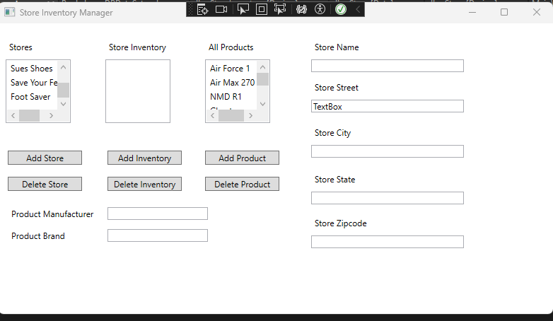

# Reading From Database

> MainWindow.xaml.cs

```csharp
using System;
using System.Collections.Generic;
using System.Linq;
using System.Text;
using System.Threading.Tasks;
using System.Windows;
using System.Windows.Controls;
using System.Windows.Data;
using System.Windows.Documents;
using System.Windows.Input;
using System.Windows.Media;
using System.Windows.Media.Imaging;
using System.Windows.Navigation;
using System.Windows.Shapes;
using System.Configuration;
using System.Data.SqlClient;
using System.Data;

namespace WpfApp1
{
    /// <summary>
    /// Interaction logic for MainWindow.xaml
    /// </summary>
    public partial class MainWindow : Window
    {

        // Holds connection to DB
        SqlConnection sqlConnection;

        public MainWindow()
        {
            InitializeComponent();
            string connectionString = ConfigurationManager.ConnectionStrings["WpfApp1.Properties.Settings.PockyLearnDBConnectionString"].ConnectionString;

            // Initialize connection
            sqlConnection = new SqlConnection(connectionString);
            DisplayStores();

            DisplayAllProducts();
        }

        // update store name in interface
        private void DisplayStores()
        {
            // Surround DB interacting code with try catch
            try
            {
                string query = "SELECT * FROM Store";

                // Connect to DB, run query and then close DB connection
                SqlDataAdapter sqlDataAdapter = new SqlDataAdapter(query, sqlConnection);

                // Use our query and connection to populate the list
                // with store names
                using (sqlDataAdapter)
                {
                    // Acts as an interface between DB and this code
                    DataTable storeTable = new DataTable();

                    sqlDataAdapter.Fill(storeTable);

                    // Define the column we are displaying in listbox
                    storeList.DisplayMemberPath = "Name";

                    // Define what is unique about each item in the list
                    storeList.SelectedValuePath = "Id";

                    // The content we will use to populate the list
                    storeList.ItemsSource = storeTable.DefaultView;
                }
            } catch (Exception ex) 
            {
                MessageBox.Show(ex.ToString());
            }
        }

        // Double click the list box to generate this
        private void storeList_SelectionChanged(object sender, SelectionChangedEventArgs e)
        {
            DisplayStoreInventory();
        }

        // Displays the shoes the store has in inventory
        // Method that will display store names
        public void DisplayStoreInventory()
        {
            // Surround DB interacting code with try catch
            try
            {
                // Find shoes that match for the specific product
                // by using the store id clicked in the listbox
                string query = "SELECT * FROM Product p INNER JOIN StoreInventory si ON p.Id = si.ProductId WHERE si.StoreId = @StoreId";
       

                // To use the passed variable we must use SqlCommand
                SqlCommand sqlCommand = new SqlCommand(query, sqlConnection);

                // Connect to DB, run query and then close DB
                // connection
                SqlDataAdapter sqlDataAdapter = new SqlDataAdapter(sqlCommand);


                // Use our query and connection to populate the list
                // with store names
                using (sqlDataAdapter)
                {
                    // We need the ID clicked to perform our query
                    sqlCommand.Parameters.AddWithValue("StoreId", storeList.SelectedValuePath);

                    // Acts as an interface between DB and this code
                    DataTable inventoryTable = new DataTable();
                    sqlDataAdapter.Fill(inventoryTable);

                    // Define the column we are displaying in listbox
                    storeInventory.DisplayMemberPath= "Brand";


                    // Define what is unique about each item in the list
                    storeInventory.SelectedValuePath = "Id";

                    // The content we will use to populate the list
                    storeInventory.ItemsSource = inventoryTable.DefaultView;

                }


            }
            catch (Exception e)
            {
                MessageBox.Show(e.ToString());
            }
        }

        // Method that will display all products
        private void DisplayAllProducts()
        {
            try
            {
                string query = "SELECT * FROM Product";

                SqlDataAdapter sqlDataAdapter = new SqlDataAdapter(query, sqlConnection);

                using (sqlDataAdapter)
                {
                    DataTable productTable = new DataTable();

                    sqlDataAdapter.Fill(productTable);

                    productList.DisplayMemberPath = "Brand";

                    productList.SelectedValuePath = "Id";

                    productList.ItemsSource = productTable.DefaultView;
                }

            }

            catch (Exception ex)
            {
                MessageBox.Show(ex.ToString());
            }
        }

        private void AddStore(object sender, RoutedEventArgs e)
        {

        }

        private void AddInventory(object sender, RoutedEventArgs e)
        {

        }

        private void AddProductClick(object sender, RoutedEventArgs e)
        {

        }

        private void DeleteStore(object sender, RoutedEventArgs e)
        {

        }

        private void DeleteInventory(object sender, RoutedEventArgs e)
        {

        }

        private void DeleteProductClick(object sender, RoutedEventArgs e)
        {

        }
    }
}

```

Result: <br>
 


[<- back](https://github.com/QuackPlayground/csharp/blob/main/theory/basic/44.md)
[continue ->](https://github.com/QuackPlayground/csharp/blob/main/theory/basic/46.md)